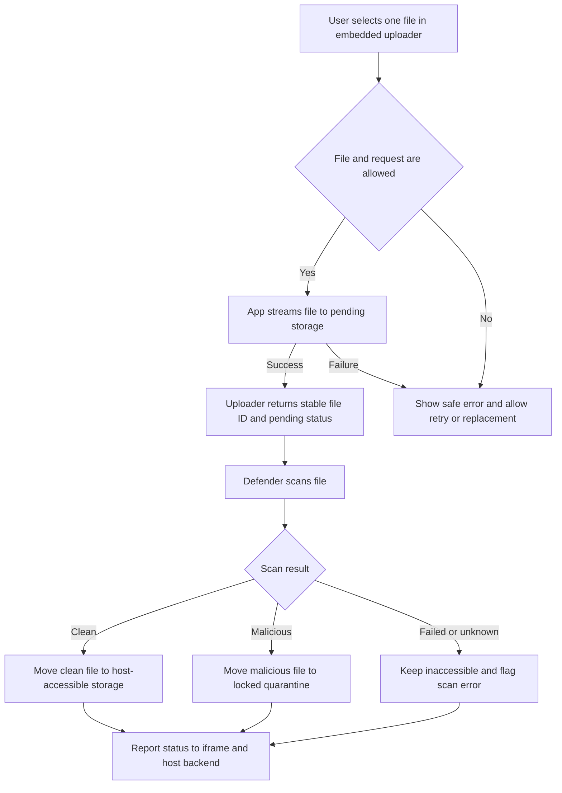

# Embedded Secure File Upload

## Problem Frame

An existing website needs a small, reusable file uploader that can be embedded in
an iframe without adding upload intake or malware-scanning responsibilities to the
host application. The host backend remains responsible for querying status and
retrieving clean files. Uploads are anonymous, so the service must limit casual
abuse, keep every new file inaccessible until Microsoft Defender for Storage has
scanned it, and give the host website a stable identifier it can use to track and
consume clean files.

This is a net-new application and Azure deployment. The first release is intended
for modest traffic and prioritizes a simple, secure processing path over maximum
upload throughput.

## User Flow

## Requirements

**Embedded Experience**

- R1. The application must provide a responsive, iframe-safe interface for one
  file per submission that meets WCAG 2.2 AA, including keyboard operation,
  visible focus, screen-reader labels, and live announcements for status changes.
- R2. The interface must support configurable accent color, display text, and
  light or dark theme while retaining a usable default appearance.
- R3. Embedding and browser messaging must be limited to a configurable allowlist
  of host origins. Messages must never be sent to an unrestricted target origin.
- R4. After accepting an upload, the interface must immediately show that the
  file was uploaded and is pending security scanning. Validation and upload
  failures must show specific, non-sensitive feedback and allow the user to retry
  or choose another file.
- R5. While the iframe remains open, it must track scan progress and notify the
  host page of status changes using browser messaging. The iframe does not restore
  an earlier upload after reload or closure; the host retains the file ID and owns
  subsequent tracking.

**Upload Policy and Abuse Controls**

- R6. Anonymous users must be able to upload without signing in.
- R7. Each request must be subject to configurable per-IP rate limits, request
  limits, and file limits. The service must separately enforce the configured
  host-origin policy as an embedding safeguard, not as caller authentication or a
  standalone abuse boundary.
- R8. The service must enforce configurable filename-extension, media-type, and
  file-size policies before accepting a file. Defaults must allow common document
  and image formats up to 100 MB.
- R9. App Service must validate and stream accepted uploads into inaccessible
  pending storage rather than exposing direct browser access to Blob Storage.
- R10. Every accepted submission must receive an unguessable, stable file ID that
  does not expose storage paths or original filenames.

**Scanning and File State**

- R11. A newly uploaded file must remain inaccessible to the host and uploader
  until Microsoft Defender for Storage reports a clean result.
- R12. A clean file must be moved from pending storage to a host-accessible
  container, and its status must become available.
- R13. A malicious file must be moved to a locked quarantine container, and its
  status must become rejected. It must never be made available to the host.
- R14. A failed, timed-out, missing, or unknown scan result must fail closed: the
  file remains inaccessible in pending storage, its status becomes scan-error,
  operators are alerted, and a controlled retry is possible.
- R15. Scan-result processing and file movement must tolerate duplicate event
  delivery without corrupting state or exposing a file prematurely.

**Host Integration and Access**

- R16. The iframe must notify its host page of accepted, pending, available,
  rejected, and scan-error states, including the stable file ID but not privileged
  storage credentials.
- R17. The host backend must be able to query current status by stable file ID
  using a designated Microsoft Entra workload identity or managed identity. Each
  deployment serves one host organization, and status access must be restricted
  to its configured backend identity or identities.
- R18. After a clean result, the host backend must retrieve the file directly from
  the clean Blob Storage container using the designated Azure identity and
  least-privilege access scoped to that deployment.
- R19. Clean files must remain until the host backend deletes them.
- R20. Quarantined files must have configurable retention, defaulting to 30 days,
  followed by automatic deletion.

**Azure Delivery and Operations**

- R21. The application must target .NET 10 LTS and run on Azure App Service.
- R22. Deployable Bicep infrastructure must provision and configure the
  application, Blob Storage, Microsoft Defender for Storage scanning,
  scan-result/event handling, identity and access assignments, monitoring, and
  required supporting resources.
- R23. Infrastructure configuration must expose environment-specific parameters,
  including allowed origins, upload policy, quarantine retention, resource
  naming, location, and capacity-related settings.
- R24. The deployment must avoid application-managed storage secrets by using
  Azure identities and least-privilege role assignments between components.
- R25. Operators must have enough telemetry to trace a file by stable file ID,
  diagnose upload and scan-processing failures, observe rate limiting, and receive
  alerts for scan-error conditions without logging file contents or sensitive
  credentials.

## Success Criteria

- A user can upload an allowed file from an approved host website and immediately
  receive a stable file ID with a pending status.
- No uploaded file can be retrieved from host-accessible storage before a clean
  Defender result has been processed.
- Clean, malicious, and failed/unknown scan outcomes reliably reach the available,
  rejected, and scan-error states respectively and are reported to the host.
- An authorized host workload can query status and retrieve only clean files
  without shared storage credentials.
- Disallowed files, oversized files, excessive requests, and unapproved embedding
  origins are rejected with clear, non-sensitive feedback.
- The embedded interface is operable with keyboard and assistive technology and
  meets the selected WCAG 2.2 AA baseline.
- A new Azure environment can be deployed repeatably from the supplied Bicep
  configuration with no manual resource creation.

## Scope Boundaries

- No end-user or uploader-specific authentication in the first release.
- No CAPTCHA, host-issued upload token, or proof-of-human challenge.
- No multi-file or batch submissions.
- No restoration of prior upload state by a reloaded or newly opened iframe.
- No end-user download link or direct browser access to Blob Storage.
- No full custom CSS supplied by host sites.
- No content moderation, document transformation, preview generation, or
  validation beyond upload policy and malware scanning.
- No indefinite retention of quarantined files.

## Key Decisions

- Anonymous upload: The iframe must work without adding a sign-in flow.
- Fail-closed scanning: Pending and uncertain files remain inaccessible; only a
  confirmed clean result can make a file available.
- Application-mediated upload: Streaming through App Service keeps initial policy
  enforcement straightforward for the expected modest traffic.
- Stable ID integration: The host receives status and correlation data rather
  than storage paths or temporary download credentials.
- Azure-native host access: The host backend uses its workload identity to query
  status and access clean blobs directly.
- Single-host deployment: One host organization is served per deployment, while
  its production, test, and other approved origins can share the configured
  allowlist.
- Configurable presentation: Limited theming improves iframe reuse without the
  security and maintenance burden of arbitrary host CSS.

## Dependencies / Assumptions

- The host website can embed the configured App Service origin and handle
  origin-validated browser messages.
- The host backend runs with a Microsoft Entra workload identity or managed
  identity that can receive narrowly scoped status and clean-container access.
- A host organization that needs an independent authorization boundary receives a
  separate deployment.
- Origin checks and per-IP throttling deter casual abuse but do not establish
  caller identity; clients outside a browser can forge origin-like headers. This
  reduced abuse-control posture is an accepted first-release tradeoff.
- Microsoft Defender for Storage is available in the deployment region and
  supports the required file sizes, formats, result delivery, and scan volume.

## Alternatives Considered

- Host-owned upload flow: Rejected because it would duplicate upload intake,
  scanning coordination, and embedded UX responsibilities in each host website.
- Direct browser-to-Blob upload: Deferred because App Service streaming provides
  simpler policy enforcement for the expected modest traffic. This decision can
  be revisited if measured throughput or App Service capacity becomes limiting.

## Outstanding Questions

### Deferred to Planning

- [Affects R12-R15][Needs research] Which Azure event delivery and processing
  pattern best consumes Defender scan results while preserving fail-closed,
  idempotent state transitions?
- [Affects R10, R16-R17][Technical] Where should file status and correlation
  metadata be stored so iframe polling and authenticated backend queries remain
  reliable?
- [Affects R22-R24][Needs research] Which Defender for Storage plan settings,
  regional constraints, service limits, and role assignments apply to the target
  Azure environment?
- [Affects R14][Technical] What bounded retry and operator recovery workflow
  should handle scan-error files without allowing unsafe release?
- [Affects R7][Technical] How should per-IP throttling account for trusted proxies
  and App Service forwarding headers without trusting spoofed client values?

## Next Steps

-> /ce-plan for structured implementation planning
