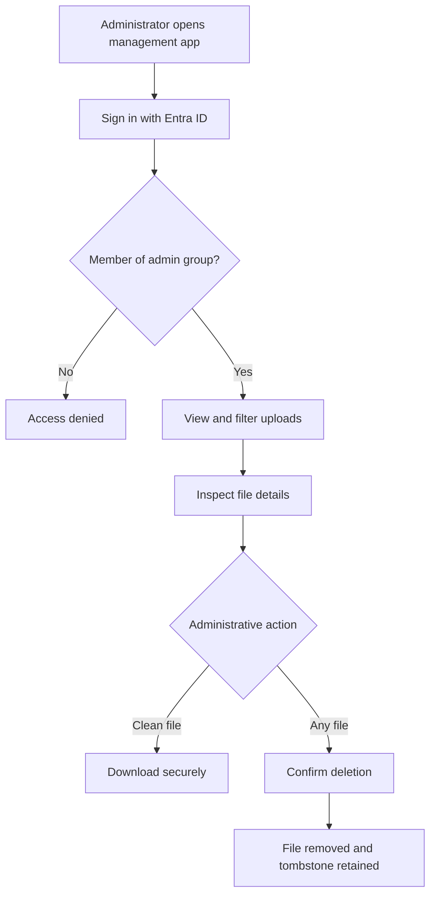

# Secure Upload File Management

## Problem Frame

Operations staff need a lightweight, secure way to inspect uploaded files and
remove them when necessary. The upload system already records file metadata and
scan state, but it has no human-facing management experience. Administrators
should not need direct Azure Storage access for routine work.

## User Flow

## Requirements

**Access and authorization**
- R1. The management component must be a separate web application from the
  public uploader and run on the existing App Service plan.
- R2. Every management page and operation must require interactive Microsoft
  Entra ID authentication.
- R3. Access must be limited to members of one configured Entra security group,
  with authorization enforced by the server rather than only by the UI.
- R4. Unauthorized and unauthenticated users must not receive file metadata,
  storage locations, or file content.

**File inventory**
- R5. Administrators must be able to view uploaded files with original filename,
  upload date and time, current scan result, file size, and final destination.
- R6. The inventory must default to newest files first and support pagination,
  filename search, and filtering by scan result.
- R7. The inventory must represent pending, clean, malicious, scan-error, and
  administratively deleted outcomes clearly.
- R8. Final destination must identify whether content is pending, clean,
  quarantined, absent after an error, or deleted.
- R9. The inventory must provide clear loading, empty, no-matching-results, and
  recoverable failure states without displaying stale data as current.

**Secure file access**
- R10. Clean files must have an authenticated download action served through the
  management application.
- R11. Quarantined files must show their destination but must not be downloadable
  through the management application.
- R12. Management links must not expose reusable anonymous access to private
  storage.

**Deletion and audit**
- R13. An authorized administrator must be able to delete a file in any state,
  including while scanning is pending.
- R14. Deletion must require explicit confirmation identifying the original
  filename and warning that content cannot be restored.
- R15. While deletion is running, duplicate submission must be prevented; success
  must show the tombstone, and failure must explain that deletion did not complete
  and allow a safe retry.
- R16. Deletion must safely prevent concurrent
  or later scan processing from restoring or promoting the file.
- R17. Deletion must remove all extant copies of the file from pending, clean,
  and quarantine storage.
- R18. The metadata record must enter a terminal deleted state and remain as a
  tombstone containing the original file metadata, deletion time (`DeletedAt`),
  and the deleting administrator's stable Entra identifier (`DeletedBy`).
- R19. Repeated deletion requests and delayed scan events must be safe and must
  not recreate content or corrupt the tombstone.

**Usability and accessibility**
- R20. All management workflows must be usable by keyboard, expose meaningful
  labels and status changes to assistive technology, and preserve visible focus.
- R21. The inventory, details, confirmation, and result states must remain usable
  on common desktop and small-screen layouts without hiding required actions or
  information.
- R22. The first release must support up to 10,000 retained status records. If
  that bounded capacity is exceeded, the inventory must fail explicitly and
  must not present partial search or pagination results as complete.

## Success Criteria

- An authorized group member can find an upload, understand its scan outcome and
  destination, and securely download a clean file.
- The same administrator can delete a file in any lifecycle state and see a
  durable deletion record identifying who deleted it and when.
- A tenant user outside the configured group cannot access management metadata
  or operations.
- The management capability operates without introducing a second metadata
  database or synchronization path.

## Scope Boundaries

- No restoration workflow for deleted files.
- No download of quarantined or known-malicious content.
- No editing, renaming, rescanning, bulk deletion, or retention-policy management.
- No user or Entra group administration inside the application.
- No SQL or Cosmos DB deployment for this scope.

## Key Decisions

- Reuse the existing Azure Table status records rather than add Azure SQL or
  Cosmos DB. The existing records already contain the required inventory data,
  and reuse avoids cost and data synchronization failures.
- Deploy management as a separate App Service on the existing plan to isolate
  interactive administrator authentication and privileged storage access from
  the anonymous iframe uploader. This security boundary is worth the additional
  deployment surface for an administrative application.
- Authorize a dedicated Entra security group rather than all tenant users or an
  application-maintained user list.
- Retain deletion tombstones for accountability while permanently removing file
  content.
- Proxy downloads of clean content through the authenticated application and
  prevent management downloads of quarantine content.
- Keep Azure Table as the only metadata store for the expected inventory of
  fewer than 10,000 records. Filter, sort, and paginate a bounded server-side
  snapshot; emit an operational signal rather than silently degrading if the
  configured cap is exceeded.

## Dependencies / Assumptions

- A tenant administrator can create or identify the Entra security group and
  approve the application permissions needed to evaluate membership.
- Existing private networking and DNS can be extended to the management App
  Service.
- Existing status records remain the source of truth for upload and scan state.
- The existing file lifecycle will be extended with a terminal deleted state and
  durable deletion audit fields; no separate audit database is required.

## Outstanding Questions

### Resolve Before Planning

None.

### Deferred to Planning

- [Affects R2-R3][Needs research] Select the simplest secure Entra integration
  for the separate management app and confirm group-overage handling.
- [Affects R13-R19][Technical] Define the concurrency-safe deletion transition
  and processor behavior for delayed scan events.

## Next Steps

→ `/ce-plan` for structured implementation planning
