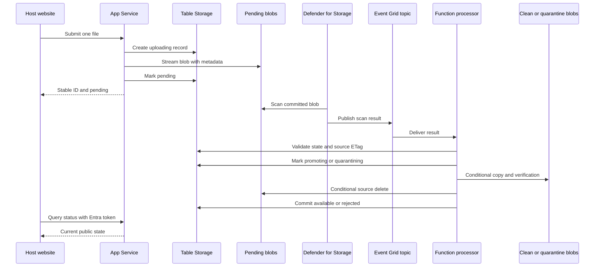
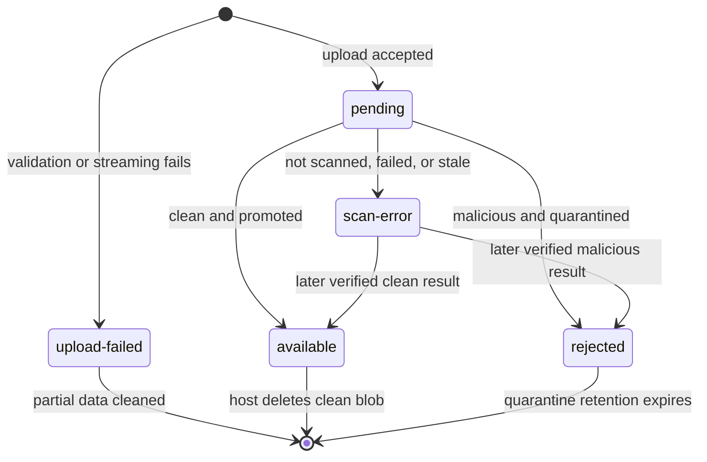
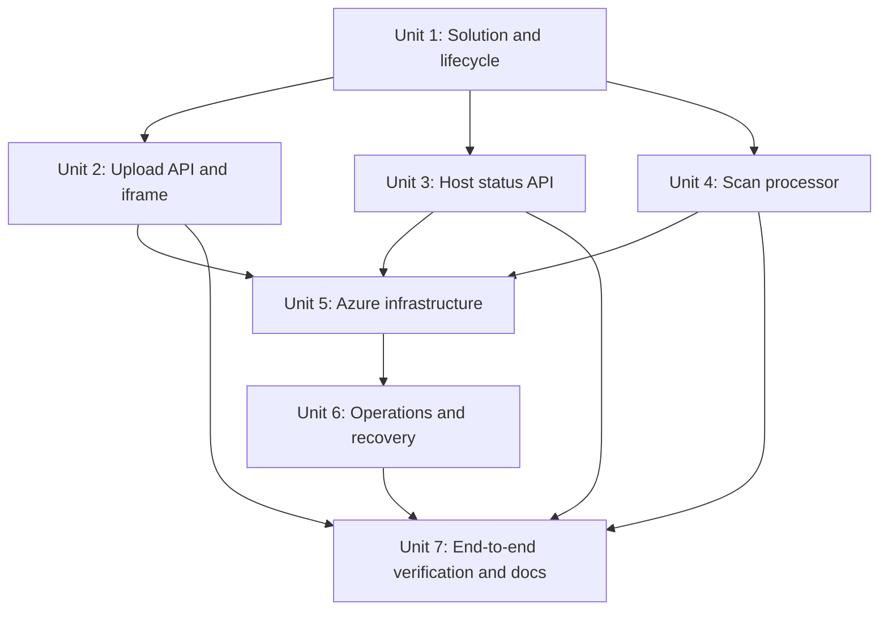
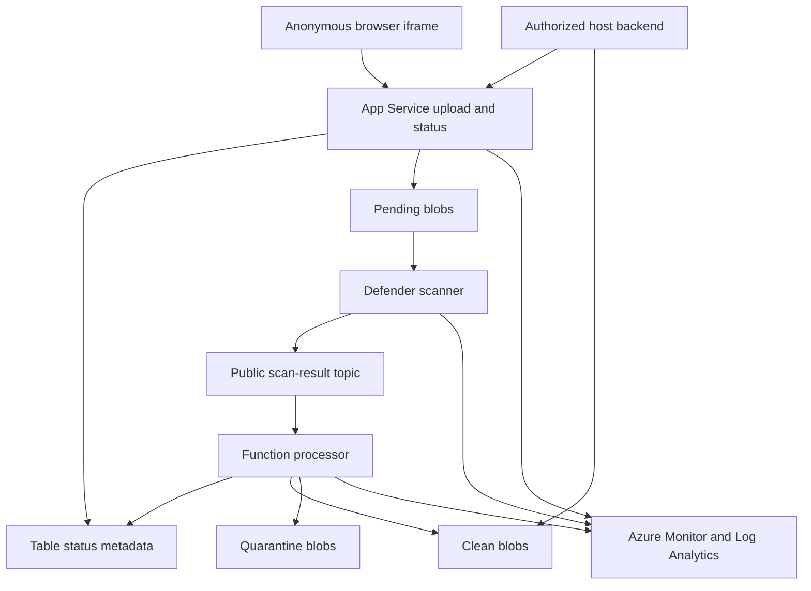

# feat: Add embedded secure file upload

## Overview

Build a greenfield .NET 10 solution that serves an accessible iframe uploader from
Azure App Service, streams anonymous uploads into private pending Blob Storage,
and publishes only files that Microsoft Defender for Storage has reported clean.
An Event Grid-triggered Azure Function will process scan results, maintain durable
status in Azure Table Storage, and move blobs into clean or quarantine containers.
Bicep will deploy the Azure resources, identities, access controls, monitoring,
and configurable policies.

The plan is intentionally fail-closed: neither a missing result nor a partial
copy/delete operation can make a file available. The requirements document remains
the authority for user-visible behavior and scope
(see origin: `docs/brainstorms/2026-08-12-embedded-secure-file-upload-requirements.md`).

## Problem Frame

The host website needs a reusable upload experience without owning upload intake
or malware-scanning coordination. Uploaders are anonymous, while the single host
organization has an authenticated backend that tracks files by stable ID and reads
only clean blobs with its Azure identity. The solution must remain usable in an
iframe, deter casual abuse, react safely to asynchronous and duplicate scan events,
and be reproducibly deployable.

## Requirements Trace

| Origin requirements | Planned delivery |
|---|---|
| R1-R5 | Accessible iframe UI, theming, approved-origin policy, upload/error states, polling, and constrained `postMessage` integration |
| R6-R10 | Anonymous single-file streaming, trusted client-IP throttling, configurable validation, private pending storage, and stable IDs |
| R11-R15 | Fail-closed lifecycle, Defender scan-result processing, clean/quarantine movement, scan errors, and idempotency |
| R16-R20 | Host messages, Entra-protected status API, identity-based clean Blob access, and retention policies |
| R21-R25 | .NET 10 App Service, Bicep deployment, environment parameters, managed identities/RBAC, telemetry, and alerts |

Success is demonstrated when an approved host can upload an allowed file, receive
a pending stable ID, observe every scan outcome, and retrieve only a confirmed-clean
blob; disallowed or excessive requests fail safely; and a new environment deploys
without manual Azure resource creation.

## Scope Boundaries

- No uploader sign-in, CAPTCHA, host-issued upload token, or caller identity for
  the anonymous upload route.
- No multiple-file batches, direct browser-to-Blob upload, end-user downloads, or
  iframe restoration after reload.
- No arbitrary host CSS, content transformation, preview generation, or content
  moderation beyond upload validation and Defender malware scanning.
- No automatic clean-file expiry; the host owns clean-file deletion.
- No Entra application registration creation in Bicep. A tenant administrator must
  provide an existing single-tenant API registration and host workload assignment.
- Origin enforcement and per-IP throttling deter casual abuse but are not presented
  as strong bot or DDoS protection.

## Context & Research

### Relevant Code and Patterns

- This repository has no existing product solution, .NET project, Azure
  infrastructure, or direct implementation pattern. The application and tests are
  net new.
- Follow repository guidance in `.github/copilot-instructions.md`: keep plans and
  requirements under the ATV documentation structure and add tests for new
  functionality.
- `.gstack/browse/test/fixtures/iframe.html` and
  `.gstack/browse/test/fixtures/upload.html` are adjacent browser fixtures only;
  they are not architecture patterns for the new application.

### Institutional Learnings

- No `docs/solutions/` artifacts currently exist. The fail-closed lifecycle,
  App Service-mediated upload, stable ID, managed identity, and single-host
  deployment decisions come from the origin document.

### External References

- ASP.NET Core 10 supports unbuffered multipart streaming and recommends
  app-generated filenames, server-side extension/size validation, and isolated
  upload storage:
  <https://learn.microsoft.com/en-us/aspnet/core/mvc/models/file-uploads?view=aspnetcore-10.0>
- ASP.NET Core provides endpoint rate limiting, but Microsoft notes that it is not
  comprehensive DDoS protection:
  <https://learn.microsoft.com/en-us/aspnet/core/performance/rate-limit?view=aspnetcore-10.0>
- Forwarded client IPs must be accepted only from known proxies:
  <https://learn.microsoft.com/en-us/aspnet/core/host-and-deploy/proxy-load-balancer?view=aspnetcore-10.0>
- Defender on-upload scanning supports all file types up to 50 GB, has a 50 GB/min
  per-account throughput limit, supports exclusion filters, and can take between
  30 minutes and three hours for complex files:
  <https://learn.microsoft.com/en-us/azure/defender-for-cloud/on-upload-malware-scanning>
  and
  <https://learn.microsoft.com/en-us/azure/defender-for-cloud/introduction-malware-scanning>
- Defender can send every result as
  `Microsoft.Security.MalwareScanningResult` through a same-region Event Grid
  custom topic using the default Event Grid schema. The topic must accept public
  network access:
  <https://learn.microsoft.com/en-us/azure/defender-for-cloud/advanced-configurations-for-malware-scanning>
- Microsoft recommends an Event Grid-triggered Function for low-latency clean or
  quarantine movement and documents the event's blob URI, ETag, result, reason,
  correlation ID, and hash:
  <https://learn.microsoft.com/en-us/azure/defender-for-cloud/defender-for-storage-configure-malware-scan>
- The Azure Monitor OpenTelemetry Distro is the supported ASP.NET Core path to
  Application Insights:
  <https://learn.microsoft.com/en-us/azure/azure-monitor/app/opentelemetry-enable>

## Key Technical Decisions

- **Solution boundaries:** Use three .NET projects: a shared domain/application
  library, an ASP.NET Core web application, and an isolated-worker Azure Function.
  This shares lifecycle contracts without coupling the Function to web hosting.
- **Status store:** Use Azure Table Storage with the stable file ID as the
  partition key and a constant row key. This distributes traffic while retaining
  direct point reads and optimistic concurrency without introducing a database
  service. Persist only operational metadata, normalized file metadata, state,
  ETags, timestamps, and failure codes; never persist file content.
- **Stable storage identity:** Generate a cryptographically unguessable file ID
  before reading the body and use it as the blob name. Preserve the original
  filename only as sanitized metadata for the host; never use it as a storage key.
- **Upload ordering:** Create an `uploading` status record first, stream the body
  directly to a block blob while supplying all required metadata on the initial
  write, then mark the record `pending` before returning. A scan event is allowed
  to race with the final status update and is reconciled through optimistic,
  monotonic transitions.
- **Public lifecycle contract:** Expose only `pending`, `available`, `rejected`,
  `scan-error`, and upload failure responses. Internal states such as `uploading`,
  `promoting`, and `quarantining` remain implementation details and map to
  `pending` externally.
- **Scan result transport:** Configure Defender to publish results to a same-region
  Event Grid custom topic and subscribe an Azure Function. Treat events as
  untrusted input: verify event type/schema, topic, storage account, pending
  container, stable ID, blob URI, and source ETag before changing state or data.
- **Movement and idempotency:** For clean or malicious results, copy to the target
  container with operations conditional on the scanned source ETag, verify copy
  completion, delete the pending source, and atomically advance status with Table
  ETags. Durable `promoting` and `quarantining` states record target-copy and
  source-cleanup progress so retries can inspect both locations and continue from
  the last completed step. Terminal states never regress, and conflicting late
  results are logged and rejected.
- **Rescan-loop prevention:** Configure Defender prefix exclusions for the clean
  and quarantine containers. Only the pending container participates in on-upload
  scanning.
- **Scan errors:** Map `Not scanned`, Defender error results, and stale pending
  records beyond a configurable three-hour default watchdog to `scan-error`. Keep
  the blob inaccessible, alert operators, and document a controlled on-demand
  rescan/re-upload recovery procedure. A later valid result may advance
  `scan-error` to the matching terminal state only through the processor.
- **Host authentication:** Protect the status route with Microsoft Entra app-only
  bearer tokens for one configured tenant, API audience, allowed client
  application ID, and dedicated application role. Require an app token and the
  expected role claim; client ID alone is not authorization. The existing API
  registration is a deployment prerequisite.
- **Blob authorization:** Assign the host workload identity read/delete access
  through a custom container-scoped role that explicitly excludes write/create
  operations. A built-in contributor role is not acceptable because it would let
  the host replace clean content without a new scan. The host receives no pending
  or quarantine access.
- **Network posture:** Disable anonymous Blob access and shared-key authorization;
  use TLS and Azure RBAC through managed identities, including identity-based
  Function host storage. Storage data-plane access uses private endpoints through
  an existing VNet because the target environment enforces disabled public Storage
  networking. Keep the Defender result topic public as required by Defender, but
  restrict publishing with the authentication mechanism supported by the Defender
  integration, do not expose topic credentials, secure Function delivery, and
  validate every event. Private ingress for the web applications remains deferred because it
  adds disproportionate first release complexity and does not replace identity
  authorization.
- **Iframe boundary:** Generate CSP `frame-ancestors` from the configured origin
  allowlist, use explicit CORS policy only where cross-origin API calls are needed,
  validate incoming message origins, and send messages only to an exact configured
  target origin.
- **Observability:** Use structured logs, OpenTelemetry/Application Insights,
  Log Analytics Defender scan-result export, metrics, and alerts correlated by
  a non-authorizing operation ID or keyed hash of the stable ID, never by raw stable
  ID, file content, or credentials. Redact URL paths that contain capability IDs.
- **Anonymous admission control:** Preserve the agreed anonymous intake, but add
  per-instance upload concurrency, global configurable request/byte budgets,
  Defender-cap admission checks, bounded polling, and an operator kill switch.
  When a safety budget is exhausted, reject new uploads before creating state or
  blobs while continuing status and scan processing.

## Open Questions

### Resolved During Planning

- **Scan-result processing:** Use Defender's custom Event Grid topic and an
  Event Grid-triggered Azure Function, following Microsoft's low-latency automation
  guidance.
- **Status persistence:** Use Azure Table Storage with optimistic concurrency.
- **Duplicate and out-of-order events:** Enforce source ETag matching and monotonic
  state transitions; terminal state conflicts are rejected and alerted.
- **Retry posture:** Use native delivery retries for transient processor failures,
  a stale-pending watchdog, and an operator runbook for controlled on-demand rescan
  or re-upload. Never release an errored file manually.
- **Client IP:** Apply forwarded headers before rate limiting, trust only the
  documented App Service proxy path, and otherwise rate-limit on the transport
  peer address.
- **Entra provisioning:** Require an existing API application registration and
  configured host client application ID and application-role identifier; Bicep
  accepts their identifiers.
- **Poison delivery:** Configure bounded Event Grid delivery attempts, retry
  duration, and dead-letter storage. Alert on every dead-lettered scan result and
  retain it for controlled replay after the underlying issue is corrected.

### Deferred to Implementation

- **Exact NuGet package versions:** Select the latest compatible stable releases
  during restore while preserving .NET 10 and Azure Functions support.
- **Exact App Service forwarded-header values:** Confirm the platform's production
  header chain during deployment validation before trusting it for IP partitioning.
- **Defender Bicep API version:** Use the newest non-deprecated API version that
  exposes on-upload scanning, result topic, prefix filters, and monthly cap at
  implementation time; validate the deployment because current documentation
  still shows preview management APIs in some examples.
- **Synchronous copy capability:** Prefer the simplest server-side copy operation
  supported for same-account 100 MB block blobs; retain the planned
  start/observe/verify state handling if the SDK performs an asynchronous copy.

## High-Level Technical Design

> *This illustrates the intended approach and is directional guidance for review,
> not implementation specification. The implementing agent should treat it as
> context, not code to reproduce.*

Public state transitions:

## Implementation Units

- [x] **Unit 1: Establish solution contracts and file lifecycle**

**Goal:** Create the .NET 10 solution, shared lifecycle model, configuration
contracts, storage abstractions, and deterministic transition rules used by the web
and processor applications.

**Requirements:** R10-R15, R21, R24

**Dependencies:** None

**Files:**
- Create: `SecureUpload.slnx`
- Create: `src/SecureUpload.Core/SecureUpload.Core.csproj`
- Create: `src/SecureUpload.Core/Files/FileRecord.cs`
- Create: `src/SecureUpload.Core/Files/FileState.cs`
- Create: `src/SecureUpload.Core/Files/FileStateMachine.cs`
- Create: `src/SecureUpload.Core/Files/FilePolicyOptions.cs`
- Create: `src/SecureUpload.Core/Storage/IFileStatusStore.cs`
- Create: `src/SecureUpload.Core/Storage/IBlobFileStore.cs`
- Create: `src/SecureUpload.Core/Storage/AzureTableFileStatusStore.cs`
- Create: `src/SecureUpload.Core/Storage/AzureBlobFileStore.cs`
- Create: `tests/SecureUpload.Core.Tests/SecureUpload.Core.Tests.csproj`
- Test: `tests/SecureUpload.Core.Tests/Files/FileStateMachineTests.cs`
- Test: `tests/SecureUpload.Core.Tests/Storage/AzureTableFileStatusStoreTests.cs`

**Approach:**
- Model internal states needed for crash recovery while keeping the five-state
  public contract stable.
- Require optimistic concurrency for every status write and encode legal,
  monotonic transitions in one shared policy. A stale writer must re-read and
  reconcile; it may never retry by overwriting a newer ETag.
- Keep original filenames and media types as untrusted metadata; use stable IDs for
  all storage and correlation operations.
- Make storage adapters independently testable against Azurite where supported.

**Execution note:** Implement lifecycle transitions test-first because they are the
central safety invariant shared by every later unit.

**Patterns to follow:**
- Origin lifecycle and stable-ID decisions in
  `docs/brainstorms/2026-08-12-embedded-secure-file-upload-requirements.md`.
- Azure SDK clients authenticated with `DefaultAzureCredential`; no connection
  strings in application settings outside local test configuration.

**Test scenarios:**
- Happy path: `uploading` advances to `pending`, then to `available` or `rejected`
  with the expected timestamps and source ETag.
- Edge case: duplicate transitions with the same event/correlation ID are
  idempotent and do not change terminal data.
- Edge case: a valid scan result racing the upload finalization reconciles without
  regressing the record.
- Edge case: upload finalization loses its ETag race to scan processing, re-reads
  the row, and preserves the newer processing or terminal state.
- Edge case: an event for an older ETag of the same stable ID is rejected even
  when its blob URI matches.
- Error path: a clean event after `rejected`, or malicious event after `available`,
  is refused and leaves the terminal state unchanged.
- Error path: a stale Table ETag causes an explicit concurrency result rather than
  silently overwriting newer state.
- Integration: create, read, conditionally update, and query a file record against
  local Table Storage semantics.

**Verification:**
- The web and Function projects can depend on one lifecycle contract that makes
  unsafe or regressive state changes impossible through normal APIs.

- [x] **Unit 2: Build the streaming upload API and embedded experience**

**Goal:** Serve the accessible iframe UI and accept one anonymous upload through a
bounded, validated, rate-limited streaming path into pending Blob Storage.

**Requirements:** R1-R10, R16, R21, R25

**Dependencies:** Unit 1

**Files:**
- Create: `src/SecureUpload.Web/SecureUpload.Web.csproj`
- Create: `src/SecureUpload.Web/Program.cs`
- Create: `src/SecureUpload.Web/Endpoints/UploadEndpoints.cs`
- Create: `src/SecureUpload.Web/Uploads/StreamingUploadService.cs`
- Create: `src/SecureUpload.Web/Uploads/UploadPolicyValidator.cs`
- Create: `src/SecureUpload.Web/Security/AllowedOriginPolicy.cs`
- Create: `src/SecureUpload.Web/Security/ClientIpPartitioner.cs`
- Create: `src/SecureUpload.Web/Pages/Upload.cshtml`
- Create: `src/SecureUpload.Web/Pages/Upload.cshtml.cs`
- Create: `src/SecureUpload.Web/wwwroot/css/uploader.css`
- Create: `src/SecureUpload.Web/wwwroot/js/uploader.js`
- Create: `src/SecureUpload.Web/appsettings.json`
- Create: `tests/SecureUpload.Web.Tests/SecureUpload.Web.Tests.csproj`
- Test: `tests/SecureUpload.Web.Tests/Uploads/UploadEndpointTests.cs`
- Test: `tests/SecureUpload.Web.Tests/Security/OriginPolicyTests.cs`
- Test: `tests/SecureUpload.Web.Tests/Security/RateLimitTests.cs`
- Test: `tests/SecureUpload.Web.Tests/Accessibility/UploadPageTests.cs`

**Approach:**
- Parse multipart boundaries directly and stream the single file section to Blob
  Storage without buffering the entire file or trusting client filenames.
- Enforce request/body limits at hosting and application layers; count actual bytes
  during streaming so a false `Content-Length` cannot bypass the limit.
- Validate configured extension and declared media type, reject empty or extra file
  sections, and treat these checks as policy—not proof of content safety.
- Create status before committing the blob. On failed streaming, delete any partial
  blob and mark the status as upload failed without returning an accepted file ID.
- Configure endpoint rate limiting after trusted forwarded-header handling, with
  separate per-instance upload concurrency, per-IP window, global request/byte
  budget, and Defender-cap admission limits. Return service-unavailable behavior
  before state creation when the kill switch or safety budget is active.
- Generate CSP `frame-ancestors`, CORS behavior, and `postMessage` target validation
  from the exact allowed-origin configuration.
- Render accessible idle, validating, uploading, pending, available, rejected,
  scan-error, and recoverable upload-error experiences. Poll only while the iframe
  remains open and announce changes through an ARIA live region.

**Execution note:** Start with failing HTTP integration tests for upload boundaries,
partial failures, and origin handling before implementing the streaming endpoint.

**Patterns to follow:**
- ASP.NET Core 10 streaming upload and security guidance cited under External
  References.
- WCAG 2.2 AA and the user-facing behavior fixed by the origin requirements.

**Test scenarios:**
- Happy path: an allowed document below 100 MB streams to the pending container,
  persists one status row, and returns an unguessable ID with `pending`.
- Edge case: a zero-byte file, exactly-at-limit file, over-limit stream, missing
  file section, second file section, disallowed extension, and disallowed media
  type each produce the documented safe response.
- Edge case: mixed-case extensions and media types are normalized before policy
  evaluation; original filenames containing paths or markup are never used as
  blob names or emitted unencoded.
- Error path: Blob write failure or client disconnect removes partial data, marks
  upload failure, and allows a new selection without returning success.
- Error path: status creation failure prevents Blob upload; status finalization
  failure after commit is recoverable by correlation and never exposes the file.
- Security: unapproved origins cannot embed the page through CSP, cannot use CORS,
  and never receive `postMessage`; forged forwarded headers from an untrusted peer
  do not change the rate-limit partition.
- Abuse: requests exceeding per-IP, concurrency, request-count, or body limits
  receive consistent retry/error responses without beginning a Blob write.
- Capacity: concurrent 100 MB uploads reach the configured admission limit with
  bounded memory; excess requests are rejected rather than queued without bound.
- Accessibility: the file control, retry action, focus order, visible focus,
  keyboard operation, status announcements, contrast themes, and narrow viewport
  meet the selected WCAG baseline.
- Integration: iframe polling maps internal processing states to `pending` and
  emits accepted, pending, available, rejected, and scan-error messages only to
  the configured parent origin.

**Verification:**
- Memory usage is not proportional to a 100 MB upload, invalid requests do not
  leave pending blobs, and the iframe remains accessible and origin-confined.

- [x] **Unit 3: Add the authenticated host status API**

**Goal:** Let the designated host workload query public file status by stable ID
without exposing upload authentication, storage credentials, or internal states.

**Requirements:** R5, R10, R16-R18, R24-R25

**Dependencies:** Unit 1

**Files:**
- Create: `src/SecureUpload.Web/Endpoints/StatusEndpoints.cs`
- Create: `src/SecureUpload.Web/Security/HostWorkloadAuthorization.cs`
- Create: `src/SecureUpload.Web/Files/PublicFileStatusMapper.cs`
- Test: `tests/SecureUpload.Web.Tests/Files/StatusEndpointTests.cs`
- Test: `tests/SecureUpload.Web.Tests/Security/HostWorkloadAuthorizationTests.cs`

**Approach:**
- Keep the iframe's same-origin polling route constrained by the unguessable file
  ID and approved embedding context; expose the host-backend route as a separate
  endpoint and response contract. Bound polling frequency per ID/session and
  return cache/retry guidance to prevent client amplification.
- Validate Entra issuer, tenant, audience, token type, and allowed client
  application identity for app-only access, including the dedicated application
  role and the version-appropriate app identity claim.
- Return only stable ID, public state, normalized metadata needed by the host, and
  relevant timestamps. Do not return pending/quarantine paths, credentials,
  malware details, internal failure text, or internal processing states.
- Make `not found` behavior consistent enough to avoid a useful enumeration side
  channel and never query by original filename.

**Execution note:** Start with authorization and response-contract integration
tests using signed test tokens and seeded status rows.

**Patterns to follow:**
- Microsoft identity platform protected API guidance:
  <https://learn.microsoft.com/en-us/entra/identity-platform/scenario-protected-web-api-app-configuration>.

**Test scenarios:**
- Happy path: an allowed host client token retrieves each public status for a known
  stable ID and sees only the public contract.
- Edge case: internal `uploading`, `promoting`, and `quarantining` states map to
  `pending`.
- Error path: missing, expired, wrong-tenant, wrong-audience, delegated-user, or
  wrong-client, roleless, or wrong-role tokens are denied.
- Error path: a valid token querying an unknown or malformed ID gets the defined
  non-sensitive response without storage access.
- Integration: a status transition written by the processor is visible to both
  iframe polling and the authenticated host endpoint.

**Verification:**
- Only the configured host workload can use the backend status API, and no response
  grants or leaks access to unsafe blobs.

- [x] **Unit 4: Implement idempotent Defender scan-result processing**

**Goal:** Consume scan events, safely promote clean blobs, quarantine malicious
blobs, fail closed on uncertain results, and recover from duplicate or partial work.

**Requirements:** R11-R16, R20, R24-R25

**Dependencies:** Unit 1

**Files:**
- Create: `src/SecureUpload.Processor/SecureUpload.Processor.csproj`
- Create: `src/SecureUpload.Processor/Program.cs`
- Create: `src/SecureUpload.Processor/Functions/ProcessScanResult.cs`
- Create: `src/SecureUpload.Processor/Functions/DetectStalePendingFiles.cs`
- Create: `src/SecureUpload.Processor/Scanning/MalwareScanEventParser.cs`
- Create: `src/SecureUpload.Processor/Scanning/ScanResultProcessor.cs`
- Create: `src/SecureUpload.Processor/Scanning/BlobPromotionService.cs`
- Create: `src/SecureUpload.Processor/appsettings.json`
- Create: `tests/SecureUpload.Processor.Tests/SecureUpload.Processor.Tests.csproj`
- Test: `tests/SecureUpload.Processor.Tests/Scanning/MalwareScanEventParserTests.cs`
- Test: `tests/SecureUpload.Processor.Tests/Scanning/ScanResultProcessorTests.cs`
- Test: `tests/SecureUpload.Processor.Tests/Scanning/BlobPromotionIntegrationTests.cs`
- Test: `tests/SecureUpload.Processor.Tests/Scanning/StalePendingTests.cs`

**Approach:**
- Accept only the documented Event Grid schema and
  `Microsoft.Security.MalwareScanningResult`; reject unexpected sources before
  parsing blob-controlled values.
- Compare event blob URI, container, stable ID, source ETag, and known status record
  before any copy or state mutation.
- For clean and malicious results, enter an internal processing state with
  optimistic concurrency, copy conditionally from the exact scanned ETag to the
  excluded target container, verify the copy, conditionally remove the source, and
  commit the terminal status. Retrying resumes safely when either copy or delete
  already succeeded and cleans duplicate or stranded target data deterministically.
- Treat `Not scanned`, explicit errors, malformed supported events, and expired
  pending records as fail-closed scan errors. Delayed Defender results remain
  pending until the watchdog threshold.
- Record sanitized SAM reason codes and event/correlation identifiers for
  operations, without returning malware names or internal details to uploaders.

**Execution note:** Implement event parsing and state transitions test-first, then
add Azurite-backed copy/delete integration coverage before wiring the Function.

**Patterns to follow:**
- Defender Event Grid event contract and Function automation guidance cited under
  External References.
- Shared state machine and storage adapters from Unit 1.

**Test scenarios:**
- Happy path: a matching clean event copies the blob to clean, marks `available`,
  and deletes pending only after destination verification.
- Happy path: a matching malicious event copies to quarantine, marks `rejected`,
  and prevents host clean-container access.
- Edge case: duplicate clean or malicious delivery is a no-op after confirming the
  durable result.
- Edge case: scan event arrives while status is still `uploading`; processing
  reconciles it without losing the result.
- Error path: wrong topic, account, container, stable ID, ETag, event type, schema
  version, or malformed blob URI performs no copy and emits security telemetry.
- Error path: clean followed by malicious, or malicious followed by clean, cannot
  reverse a terminal state and raises an operational conflict signal.
- Error path: a stale result for an older source ETag cannot promote bytes that
  differ from those Defender scanned.
- Error path: `Not scanned`, timeout, inaccessible blob, password protection,
  nesting limit, throttling, and unknown results remain inaccessible and map to a
  sanitized `scan-error`.
- Recovery: copy success plus status failure, status success plus source-delete
  failure, duplicate target blob, and transient Storage failure all resume without
  duplicate exposure or data loss.
- Recovery: replay the same result after each partial copy/delete/status failure;
  one target remains, stranded sources are removed, and terminal state is written
  once.
- Poison path: repeated transient failures exhaust the configured delivery budget,
  dead-letter the event, alert operators, and leave the file inaccessible.
- Watchdog: a record younger than the configured threshold remains pending; an
  older nonterminal record becomes `scan-error` once and triggers an alert.
- Integration: copied blobs in clean and quarantine do not enter another actionable
  scan cycle.

**Verification:**
- Every supported Defender outcome reaches exactly one safe public state, and
  replaying any event or failure point cannot expose an unverified file.

- [x] **Unit 5: Provision the Azure platform with modular Bicep**

**Goal:** Deploy all Azure-owned resources, configuration, identities, RBAC,
Defender scanning, retention, and event wiring repeatably for one host organization.

**Requirements:** R7-R9, R11-R12, R17-R25

**Dependencies:** Units 2-4

**Files:**
- Create: `infra/main.bicep`
- Create: `infra/main.bicepparam`
- Create: `infra/modules/hosting.bicep`
- Create: `infra/modules/storage.bicep`
- Create: `infra/modules/defender.bicep`
- Create: `infra/modules/event-processing.bicep`
- Create: `infra/modules/identity.bicep`
- Create: `infra/modules/monitoring.bicep`
- Create: `infra/tests/main.test.bicep`
- Create: `infra/tests/security.test.bicep`
- Create: `infra/README.md`

**Approach:**
- Provision an App Service plan, .NET 10 web app, Function App, Storage account,
  pending/clean/quarantine containers, status table, same-region Event Grid custom
  topic and subscription with dead-letter destination, Application Insights, Log
  Analytics, action group, and alerts.
- Disable Blob public access, shared-key authorization, insecure transfer, and
  unneeded cross-tenant replication; enforce current TLS and secure defaults.
- Give the web identity pending Blob write/delete plus status-table access; give
  the processor pending/clean/quarantine Blob access plus status-table access; give
  the host identity the custom read/list/delete-without-write role only on the clean
  container. Configure the Function host and bindings for identity-based Storage
  access so shared-key authorization remains disabled.
- Enable Defender on-upload scanning with a configurable monthly GB cap, Log
  Analytics result export, custom result topic, and exclusions for clean and
  quarantine prefixes.
- Apply a quarantine-only lifecycle deletion rule using the configurable 30-day
  default. Do not place an expiry policy on clean blobs.
- Parameterize location, names, SKUs/capacity, origins, upload policy, throttles,
  per-instance concurrency, global budgets, polling, watchdog, retention, Defender
  cap, Entra tenant/audience/client/role IDs, host identity resource ID, kill
  switch, Event Grid retry/dead-letter policy, and alert destinations. Keep secrets
  out of parameters and outputs.
- Deploy in dependency order: Storage and identities; RBAC and custom roles;
  Defender and its same-region default-schema custom topic; Function host storage
  and Function App; event subscription; web app; then smoke checks. Confirm .NET 10
  App Service and Functions runtime support in the target region before deployment.
- Treat Defender-created scanner/system-topic resources as service-owned. Bicep
  configures Defender and the separate scan-result custom topic but does not
  redeclare or delete Defender-managed resources.
- Expose only deployment outputs needed for app deployment and host integration.

**Patterns to follow:**
- Microsoft Defender infrastructure-as-code and configuration guidance linked from
  the on-upload scanning documentation.
- Azure resource modules with narrow responsibilities and explicit outputs; use
  current stable resource API versions where capability permits.

**Test scenarios:**
- Static: template compilation and linter checks pass with the sample parameter
  file and no hardcoded environment identifiers or secrets.
- Security: Storage rejects anonymous/shared-key use, containers are private, HTTPS
  is required, and identities receive only their documented data-plane scopes.
- Security: the host can read/list/delete a clean blob but cannot create or
  overwrite one; Function host operations succeed without restoring shared-key
  authorization.
- Configuration: Defender scanning targets pending uploads, publishes to the
  same-region custom topic, excludes clean/quarantine prefixes, and honors the cap.
- Retention: quarantine blobs match the deletion rule while clean blobs do not.
- Authentication: web settings contain identifiers for the existing Entra API
  registration and allowed host client, not a client secret.
- Idempotency: redeploying unchanged parameters does not replace data resources or
  broaden role assignments.
- Rollout: deployment waits for and rechecks RBAC propagation before smoke tests;
  transient propagation delay cannot be mistaken for an application defect.
- Failure: invalid origin, retention, size, or Defender-cap parameters fail
  validation before resource creation.

**Verification:**
- A fresh resource group receives a complete, repeatable environment with no
  manual Azure resource creation beyond the declared Entra prerequisite.

- [x] **Unit 6: Add observability, alerts, and operator recovery**

**Goal:** Make upload and scan failures diagnosable by stable ID and provide a safe
operator procedure for scan errors and quarantined files.

**Requirements:** R14, R20, R22-R25

**Dependencies:** Unit 5

**Files:**
- Create: `src/SecureUpload.Core/Telemetry/TelemetryNames.cs`
- Create: `src/SecureUpload.Web/Telemetry/UploadTelemetry.cs`
- Create: `src/SecureUpload.Processor/Telemetry/ScanTelemetry.cs`
- Create: `docs/operations/secure-upload-runbook.md`
- Create: `docs/operations/secure-upload-alerts.md`
- Test: `tests/SecureUpload.Web.Tests/Telemetry/UploadTelemetryTests.cs`
- Test: `tests/SecureUpload.Processor.Tests/Telemetry/ScanTelemetryTests.cs`

**Approach:**
- Emit structured traces and metrics for accepted/rejected uploads, byte counts,
  rate limiting, scan latency/outcomes, invalid events, processing retries,
  stale-pending detection, copy/delete failures, and terminal conflicts.
- Use stable file ID, event ID, and Defender correlation ID as correlation fields;
  redact original filenames where logs do not require them and never log content,
  bearer tokens, storage credentials, or full untrusted event payloads.
- Alert on scan errors, stale pending records, malformed-source events, repeated
  processor failures, terminal conflicts, Defender cap proximity, and missing scan
  activity.
- Alert on upload-byte/request budget proximity, kill-switch activation, Event Grid
  dead letters, Function retry exhaustion, scan-lag percentiles, and the oldest
  pending age.
- Document controlled recovery: investigate the SAM reason, correct configuration
  if necessary, invoke a supported on-demand rescan or require re-upload, and allow
  only a later validated processor event to release or quarantine the blob.
- Document quarantine access, false-positive submission, retention behavior, and
  host deletion ownership.

**Patterns to follow:**
- Azure Monitor OpenTelemetry Distro and Defender Log Analytics scan-result table
  described in External References.

**Test scenarios:**
- Happy path: one upload and one scan produce correlated telemetry without file
  content or credentials.
- Error path: scan-error and stale-pending conditions emit one metric/alert signal
  per durable transition, not per retry.
- Security: malicious filenames, malware names, tokens, and event bodies are
  absent from normal structured logs; raw stable IDs and capability-bearing URL
  paths are redacted.
- Recovery: the runbook covers transient, unsupported, permission, throttling,
  timeout, and malicious/false-positive outcomes without any manual clean release.

**Verification:**
- An operator can start with a stable ID or alert, determine the safe current state,
  and follow a documented recovery path without inspecting application secrets.

- [x] **Unit 7: Complete cross-component verification and integration docs**

**Goal:** Prove the deployed behavior across browser, API, Storage, Event Grid
contracts, and identities, and provide host/deployment documentation.

**Requirements:** R1-R25 and all success criteria

**Dependencies:** Units 2-6

**Files:**
- Create: `tests/SecureUpload.EndToEnd.Tests/SecureUpload.EndToEnd.Tests.csproj`
- Test: `tests/SecureUpload.EndToEnd.Tests/UploadLifecycleTests.cs`
- Test: `tests/SecureUpload.EndToEnd.Tests/AuthorizationBoundaryTests.cs`
- Test: `tests/SecureUpload.EndToEnd.Tests/FailureRecoveryTests.cs`
- Create: `tests/SecureUpload.Browser.Tests/package.json`
- Test: `tests/SecureUpload.Browser.Tests/uploader.spec.ts`
- Create: `README.md`
- Create: `docs/integration/iframe-host-guide.md`
- Create: `docs/integration/host-backend-guide.md`
- Create: `docs/deployment/azure-deployment-guide.md`

**Approach:**
- Use local emulators and recorded Defender event fixtures for deterministic
  integration tests; reserve a small Azure smoke suite for contracts emulators
  cannot prove, especially Defender-to-Event Grid and managed identity/RBAC.
- Exercise the real browser message boundary with an approved and an unapproved
  host page, keyboard-only interaction, responsive viewports, and theme variants.
- Document the iframe URL/configuration, exact message types and fields, status
  contract, Entra token audience/client setup, clean-container naming/access, and
  host deletion responsibility.
- Document deployment prerequisites, parameters, Defender regional/cost checks,
  smoke validation, rollback behavior, and teardown cautions for retained data.

**Patterns to follow:**
- Requirements and public states from the origin document; do not expose internal
  processor states as a new host contract.

**Test scenarios:**
- End to end: upload an allowed benign fixture, apply a clean event, observe
  `pending` then `available`, and retrieve the blob only with the host identity.
- End to end: upload the standard EICAR test fixture in an isolated test
  environment, observe rejection/quarantine, and prove the host identity cannot
  read it.
- End to end: apply `Not scanned` and timeout fixtures, observe `scan-error`, and
  prove neither host nor browser can read pending data.
- Security: anonymous upload cannot call host status; host identity cannot access
  pending/quarantine or write clean; web identity cannot read clean; processor
  receives only its required scopes.
- Race: replay and reorder clean/malicious events and inject copy/delete failures;
  the final state and blob placement remain safe and deterministic.
- Browser: approved embedding, rejected embedding, exact-origin messaging,
  keyboard workflow, live announcements, retry behavior, dark/light themes, and
  narrow layouts match the documented contract.
- Deployment: a clean environment deploys from Bicep, produces expected outputs,
  and records an actual Defender result in Event Grid and Log Analytics.
- Capacity: sustained maximum-size uploads demonstrate bounded per-instance memory
  and explicit admission rejection; multi-instance polling remains within the
  configured request budget and status latency target.
- Integrity: deleting an available clean blob as the host does not let a duplicate
  scan event recreate it, and quarantine lifecycle expiry does not erase its status
  or audit metadata.

**Verification:**
- Automated and Azure smoke coverage demonstrate every success criterion and
  trust boundary, and host/operators can integrate without reverse-engineering the
  application.

## System-Wide Impact

- **Interaction graph:** Browser requests enter the web app; blob commits trigger
  Defender independently; Defender results traverse the custom topic to the
  Function; Table state joins these asynchronous paths; the host reads status
  through the web app and clean content through Blob Storage.
- **Error propagation:** Validation and streaming errors return safe retryable UI
  responses. Scan and processor uncertainty becomes `scan-error` and an operator
  alert, never success. Infrastructure/auth failures remain explicit and observable.
- **State lifecycle risks:** Table writes can race scan results; copy can complete
  before status or delete; Event Grid is at-least-once and can reorder deliveries;
  host deletion and quarantine expiry can happen after terminal state. The plan
  addresses these with ETags, monotonic transitions, resumable steps, conditional
  source operations, persistent audit metadata, and source-event validation.
- **API surface parity:** Iframe polling and host status use the same public-state
  mapper. Only the host route requires Entra authentication; neither surface
  exposes internal states or unsafe storage paths.
- **Integration coverage:** Mocks cannot prove Defender result delivery, Entra
  app-only validation, Azure RBAC, lifecycle deletion, or App Service proxy
  behavior; retain an Azure smoke environment for these contracts.
- **Unchanged invariants:** The host never receives pending/quarantine credentials,
  anonymous users never become authenticated principals, and only a validated
  clean event can produce host-readable content.

## Dependencies / Prerequisites

- Azure subscription and target region supporting App Service, Azure Functions,
  Blob/Table Storage, Event Grid custom topics, Defender for Storage on-upload
  scanning, Log Analytics, and Application Insights.
- Registered `Microsoft.EventGrid`, `Microsoft.Security`, `Microsoft.Storage`,
  `Microsoft.Web`, `Microsoft.Insights`, and Operational Insights providers.
- Permission to enable Defender for Storage and create data-plane role assignments.
- Existing single-tenant Entra API application registration with an application
  role/scope suitable for app-only status access.
- Existing host workload identity or service principal assigned to that API role
  and available for clean-container RBAC.
- Approved host origins and operational alert recipients for each environment.

## Risk Analysis & Mitigation

| Risk | Likelihood | Impact | Mitigation |
|---|---|---|---|
| Anonymous endpoint is abused despite IP limits | Medium | High | Strict body/concurrency/rate limits, cost alerts, Defender cap, telemetry, and an explicit future WAF/token escalation point |
| Distributed abuse bypasses per-IP controls | Medium | High | Global request/byte budgets, Defender-cap admission, bounded concurrency, kill switch, and documented acceptance of public intake |
| Forged forwarded IP bypasses or poisons throttling | Medium | Medium | Trust forwarded headers only from the verified App Service proxy chain; otherwise use transport IP |
| Defender result is delayed, missing, unsupported, or erroneous | Medium | High | Three-hour configurable watchdog, fail-closed state, Log Analytics audit, alert, and controlled rescan/re-upload |
| Event Grid delivers duplicate, malformed, or conflicting events | High | High | Validate source contract, match blob ETag, use optimistic concurrency and monotonic terminal states |
| Event Grid publisher credentials or delivery are abused | Low | High | Use the Defender-supported topic publisher authentication, never expose topic keys, constrain subscription delivery, validate payload/source, dead-letter failures, and alert on invalid events |
| Copy succeeds but status/delete fails | Medium | High | Durable processing states, destination verification, resumable retries, and availability only after status commit |
| Destination copy retriggers Defender indefinitely | Medium | Medium | Exclude clean and quarantine prefixes and verify this in Azure smoke tests |
| Host receives overly broad Storage access | Medium | High | Container-scoped clean access only; authorization-boundary tests inspect deployed role assignments |
| Host overwrites a clean blob with unscanned bytes | Medium | High | Custom clean-container role permits read/list/delete but excludes create/write/overwrite; deployed negative tests prove denial |
| Event Grid result topic must be public | High | Medium | Accept the documented platform constraint, use Azure Function subscription security, validate every event, and monitor invalid deliveries |
| Defender Bicep surface changes or remains preview | Medium | Medium | Isolate Defender deployment in one module, select current API during implementation, and validate with what-if/deployment tests |
| App Service memory/timeout pressure from 100 MB files | Medium | Medium | True streaming, concurrency limit, aligned platform limits, cancellation propagation, and load testing |
| Multi-instance middleware limits are mistaken for global limits | Medium | Medium | Separate per-instance limits from global admission budgets and validate both under scale-out |
| Clean files accumulate indefinitely | High | Medium | Preserve host-owned retention decision, document deletion responsibility, and monitor storage growth |
| Quarantine contains dangerous content | Medium | High | No host/web access, narrow processor/operator access, 30-day lifecycle deletion, and incident runbook |

## Phased Delivery

### Phase 1: Safe local contracts

- Complete Units 1-4 with emulator-backed tests and recorded Defender fixtures.
- Demonstrate the full state machine and failure recovery without an Azure
  dependency.

### Phase 2: Azure deployment and operations

- Complete Units 5-6 in a nonproduction subscription.
- Validate Defender/Event Grid contracts, RBAC boundaries, scan latency, cap, and
  alert routing before exposing the upload URL.
- Gate cutover on .NET 10 runtime availability, identity-based Function storage,
  RBAC propagation, dead-letter readiness, and a disabled upload kill switch.

### Phase 3: Host integration

- Complete Unit 7, onboard the approved host origins and workload identity, and run
  clean, malicious, not-scanned, replay, and accessibility acceptance scenarios.

## Documentation / Operational Notes

- `README.md` should provide solution orientation and links, not duplicate the
  deployment, host integration, or operations guides.
- `docs/deployment/azure-deployment-guide.md` must list the Entra prerequisite,
  supported-region check, Defender cost/cap decision, Bicep parameters, and smoke
  validation.
- `docs/integration/iframe-host-guide.md` must define sizing, theme configuration,
  exact-origin messaging, message versioning, and reload ownership.
- `docs/integration/host-backend-guide.md` must define app-only token acquisition,
  status semantics, clean Blob lookup/access, and deletion ownership.
- `docs/operations/secure-upload-runbook.md` must prohibit manual promotion and
  cover scan errors, false positives, quarantine access, stale files, and cap
  exhaustion.
- Rollback must disable new ingress first while preserving scan processing, blobs,
  and status rows. Teardown defaults to retaining/exporting data; destructive data
  removal requires an explicit separate action.

## Sources & References

- **Origin document:**
  [docs/brainstorms/2026-08-12-embedded-secure-file-upload-requirements.md](../brainstorms/2026-08-12-embedded-secure-file-upload-requirements.md)
- **Repository guidance:** `.github/copilot-instructions.md`
- **ASP.NET Core uploads:**
  <https://learn.microsoft.com/en-us/aspnet/core/mvc/models/file-uploads?view=aspnetcore-10.0>
- **ASP.NET Core rate limiting:**
  <https://learn.microsoft.com/en-us/aspnet/core/performance/rate-limit?view=aspnetcore-10.0>
- **ASP.NET Core proxy handling:**
  <https://learn.microsoft.com/en-us/aspnet/core/host-and-deploy/proxy-load-balancer?view=aspnetcore-10.0>
- **Defender on-upload scanning:**
  <https://learn.microsoft.com/en-us/azure/defender-for-cloud/on-upload-malware-scanning>
- **Defender scanning overview and limitations:**
  <https://learn.microsoft.com/en-us/azure/defender-for-cloud/introduction-malware-scanning>
- **Defender Event Grid and Log Analytics configuration:**
  <https://learn.microsoft.com/en-us/azure/defender-for-cloud/advanced-configurations-for-malware-scanning>
- **Defender result handling and Function automation:**
  <https://learn.microsoft.com/en-us/azure/defender-for-cloud/defender-for-storage-configure-malware-scan>
- **Defender result and SAM error meanings:**
  <https://learn.microsoft.com/en-us/azure/defender-for-cloud/understand-malware-scan-results>
- **Azure Monitor OpenTelemetry:**
  <https://learn.microsoft.com/en-us/azure/azure-monitor/app/opentelemetry-enable>
- **Blob lifecycle policy:**
  <https://learn.microsoft.com/en-us/azure/storage/blobs/lifecycle-management-policy-configure>
