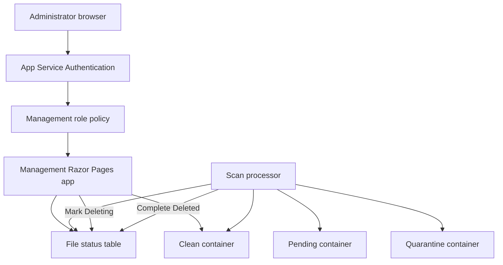
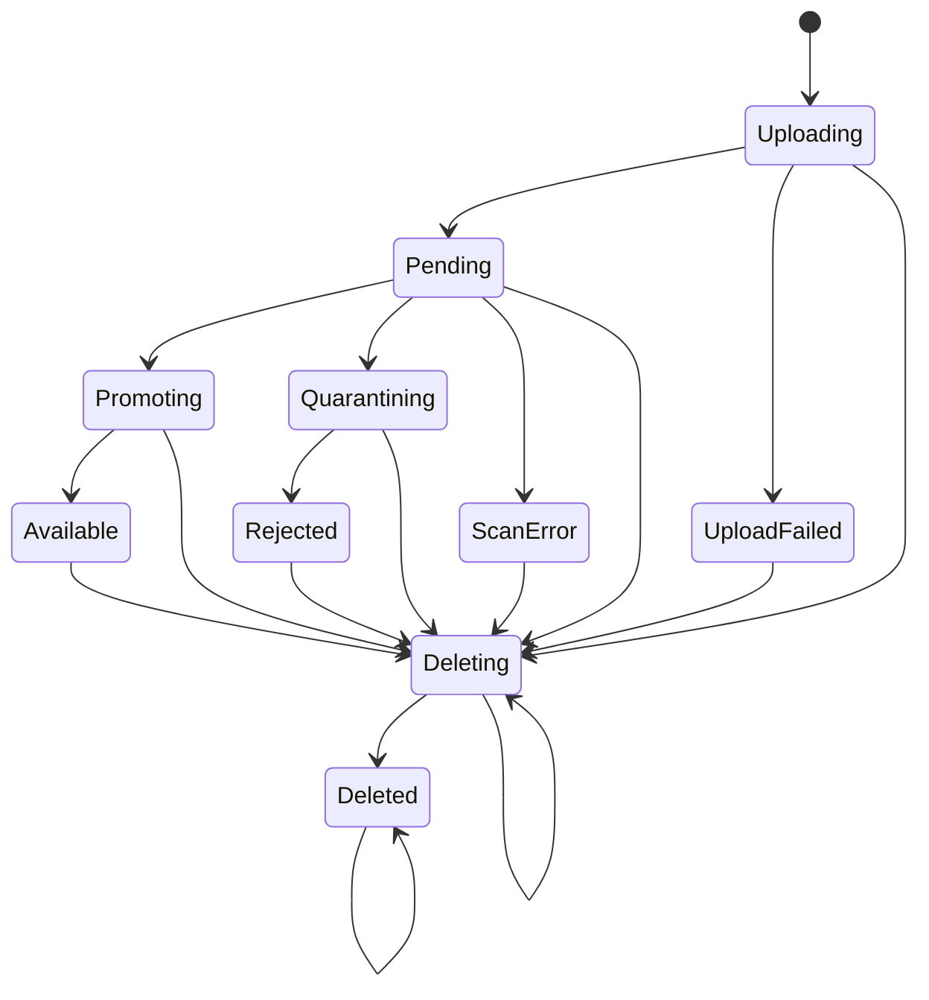
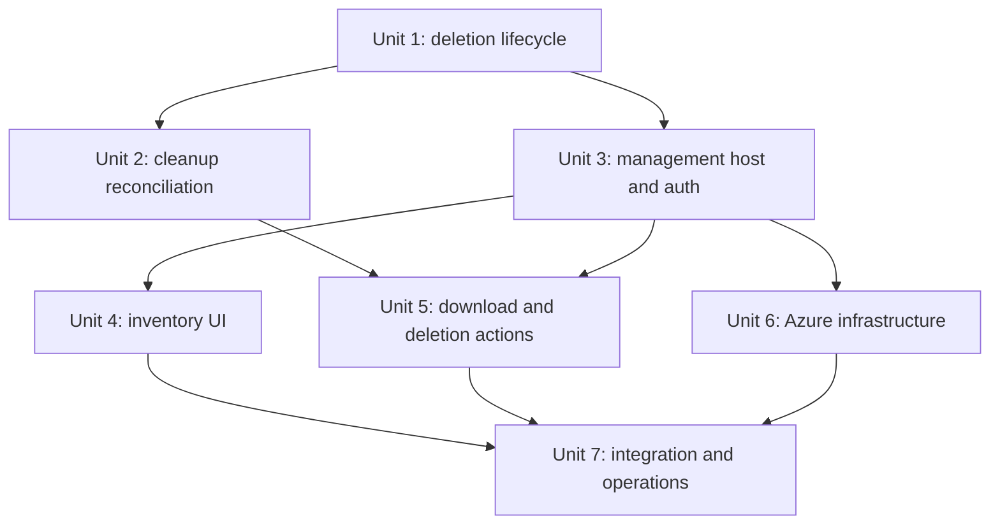

# feat: Add secure file management

## Overview

Add a separate .NET 10 management web application to the existing App Service
plan. The application will use interactive, single-tenant Microsoft Entra
authentication, enforce a dedicated management app role assigned to an Entra
security group, list the existing Azure Table status records, stream only clean
files, and permanently delete content while retaining an auditable tombstone.

The existing `filestatus` Azure Table remains the sole metadata store. Because
the expected retained inventory is below 10,000 records, the management
application will load a bounded status snapshot, then filter, sort, and paginate
it in memory. It must reject an over-cap inventory explicitly instead of showing
partial results.

## Problem Frame

Operations staff need routine visibility and deletion controls without direct
Azure Storage access. The current system records the needed upload and scan
metadata but exposes only single-file status APIs and has no interactive
administrator experience. The new surface must preserve the uploader's
least-privilege, fail-closed behavior while introducing destructive operations
and user identity auditing (see origin:
`docs/brainstorms/2026-08-14-file-management-requirements.md`).

## Requirements Trace

- R1. Deploy management as a separate web application on the existing App
  Service plan.
- R2-R4. Require interactive single-tenant Entra authentication, enforce
  dedicated-group authorization server-side, and disclose nothing to
  unauthorized callers.
- R5-R9. Show the required metadata and logical destinations in a newest-first,
  searchable, filterable, paginated inventory with complete loading, empty,
  no-match, and failure states.
- R10-R12. Stream clean files through an authenticated endpoint; never expose
  quarantine downloads or reusable anonymous storage access.
- R13-R19. Delete files from any lifecycle state through an explicit,
  concurrency-safe, retryable operation that retains `DeletedAt` and `DeletedBy`
  in a terminal tombstone.
- R20-R21. Support keyboard, assistive technology, visible focus, and small
  screens throughout the management workflow.
- R22. Support up to 10,000 retained status rows and fail explicitly above the
  configured cap without returning incomplete results.
- Success criteria. Authorized administrators can inspect, download clean, and
  delete any file; unauthorized tenant users receive no metadata or content; no
  second metadata database or index synchronization path is introduced.

## Scope Boundaries

- No restore, rescan, rename, edit, bulk deletion, or retention-policy controls.
- No management-app download path for pending, quarantined, rejected, scan-error,
  deleting, or deleted content.
- No SQL, Cosmos DB, Azure AI Search, or secondary Azure Table index.
- No Entra group administration from the application.
- No backfill of existing status rows; new nullable tombstone fields preserve
  backward compatibility.
- No change to the public iframe uploader or host workload API contracts except
  their shared understanding of the expanded file lifecycle.

## Context & Research

### Relevant Code and Patterns

- `src/SecureUpload.Core/Files/FileStateMachine.cs` centralizes monotonic,
  ETag-aware lifecycle transitions and is the authority for new deletion states.
- `src/SecureUpload.Core/Storage/AzureTableFileStatusStore.cs` maps
  `FileRecord` to Azure Table and already requires concrete ETags for updates.
- `src/SecureUpload.Core/Storage/AzureBlobFileStore.cs` provides ETag-guarded
  blob inspection and deletion and container-specific access through
  `BlobArea`.
- `src/SecureUpload.Processor/Scanning/ScanResultProcessor.cs` retries Table
  concurrency conflicts and must reconcile in-flight copies when deletion wins.
- `src/SecureUpload.Web/Security/HostWorkloadAuthorization.cs` demonstrates
  explicit claim validation and policy-based server authorization, but its
  app-only JWT scheme must not be reused as interactive user authentication.
- `src/SecureUpload.Web/Pages/Upload.cshtml` and
  `tests/SecureUpload.Web.Tests/Accessibility/UploadPageTests.cs` establish the
  Razor Pages and accessibility-test patterns.
- `infra/modules/hosting.bicep` deploys Linux .NET 10 apps with VNet integration,
  managed identity, App Insights, and security settings.
- `infra/modules/identity.bicep` uses container/table-scoped custom roles and
  role assignments rather than account keys.
- `infra/modules/monitoring.bicep` centralizes Application Insights and
  management alerts.

### Institutional Learnings

- The existing upload plan requires optimistic concurrency, monotonic terminal
  states, source-ETag matching, and privacy-safe telemetry
  (`docs/plans/2026-08-12-001-feat-embedded-secure-upload-plan.md`).
- Direct Blob URLs, filenames, stable IDs, and event payloads must not be copied
  into operational telemetry or tickets
  (`docs/operations/secure-upload-runbook.md`).
- Private Storage access depends on App Service VNet integration, private
  endpoints, private DNS, managed identity, and data-plane RBAC
  (`docs/deployment/azure-deployment-guide.md`).

### External References

- App Service authentication and authorization:
  https://learn.microsoft.com/azure/app-service/overview-authentication-authorization
- Accessing user identities with App Service authentication:
  https://learn.microsoft.com/azure/app-service/configure-authentication-user-identities
- Microsoft Entra application roles:
  https://learn.microsoft.com/entra/identity-platform/howto-add-app-roles-in-apps
- Azure Table query ordering and continuation behavior:
  https://learn.microsoft.com/rest/api/storageservices/querying-tables-and-entities
- Azure Table design and optimistic concurrency:
  https://learn.microsoft.com/azure/storage/tables/table-storage-design
- Azure Table secondary-index tradeoffs:
  https://learn.microsoft.com/azure/storage/tables/table-storage-design-patterns

## Key Technical Decisions

- **Use an Entra app role assigned to the administrator security group.** The
  management app registration will expose one role such as
  `SecureUpload.Management`; the selected security group is assigned to that
  role on the enterprise application. Application code checks the `roles` claim
  on every protected request. This satisfies group-based access without direct
  group claims, Microsoft Graph permissions, or group-overage handling.
- **Layer App Service Authentication with application authorization.** Easy Auth
  rejects unauthenticated traffic at the platform boundary using a single-tenant
  v2 issuer. The ASP.NET Core application builds the principal from the trusted
  App Service identity header and applies a global fallback policy plus the
  required app role. The header is unsigned and is trusted only because
  `authsettingsV2` requires authentication on every management path and App
  Service strips caller-supplied identity headers before injecting its own.
  Application code bounds/parses the principal structure and validates unique
  tenant, user object ID, and role claims. Local/integration tests substitute a
  deterministic authentication handler rather than treating an environment
  variable as request attestation.
- **Limit authorization revocation latency.** Use fixed, short management
  sessions so removal of the group-to-role assignment takes effect within the
  documented session window. Sign-out terminates the App Service session; tenant
  setup enables assignment-required and prohibits direct-user or service-
  principal role assignments.
- **Keep one metadata source for the bounded workload.** Azure Table cannot sort
  by date or search filenames using the current random partition key. For the
  confirmed sub-10,000-row workload, enumerate at most `capacity + 1` rows,
  reject over-cap snapshots, normalize/filter in memory, sort by `CreatedAt`
  descending with `StableId` as a deterministic tie-breaker, and then paginate.
  Do not introduce an eventually consistent index. If the cap is exceeded, the
  global inventory fails explicitly but authenticated exact-file-ID point lookup
  remains available for incident operations while the capacity runbook is
  invoked.
- **Use two deletion states with processor-owned cleanup.** The management app
  performs only an ETag-guarded transition to `Deleting`, capturing the first
  request's stable Entra `oid` and request time. `Deleting` blocks every scan
  transition. The processor owns blob cleanup and the final transition to
  `Deleted`, so a management-app crash or compromise cannot strand the operation
  or read pending/quarantine content.
- **Make cleanup idempotent and processor-aware.** A timer-triggered deletion
  reconciler processes `Deleting` rows promptly, while scan-event processing
  also reconciles `Deleting` or `Deleted` after losing an ETag race or receiving
  a delayed event. Cleanup reads a concrete blob ETag, deletes with `If-Match`,
  treats not-found as success, and treats mismatch/reappearance as incomplete.
  Only verified absence across all containers permits `Deleting` to become
  `Deleted`; exhaustion remains retryable and emits an operational signal.
- **Constrain management Storage permissions to its routes.** The management
  identity receives status-table entity read/update only and clean-container
  blob read only. It cannot add/delete status rows or access pending/quarantine.
  The processor retains cleanup rights on all containers.
- **Never issue SAS URLs.** Clean content is streamed by the authenticated
  application with attachment, no-sniff, and no-store response headers. The
  read is conditional on the persisted target ETag, uses a framework-generated
  safe `Content-Disposition`, and returns `application/octet-stream`. The logical
  destination is displayed as a state/container label, not a raw Blob URI.
- **Treat App Registration setup as an explicit deployment prerequisite.**
  Bicep configures the App Service auth resource from supplied client/tenant
  values, but creation of the Entra app role, enterprise-app assignment
  requirement, group-to-role assignment, redirect URI, and credential remain
  tenant-administrator steps documented alongside deployment.
- **Use a Key Vault reference for the Easy Auth credential.** Bicep accepts an
  existing Key Vault resource/secret URI, grants only the management identity
  secret-read access, and configures the provider setting as a Key Vault
  reference. Secret material never appears in parameter files, outputs, or
  deployment arguments.

## Open Questions

### Resolved During Planning

- **Database choice:** Reuse the existing Azure Table status rows; the confirmed
  inventory is under 10,000 records and does not justify SQL, Cosmos DB, or a
  secondary index.
- **Newest-first search/pagination:** Use a bounded in-memory snapshot with a
  deterministic sort and hard capacity failure rather than misleading partial
  results.
- **Entra group overage:** Assign the group to an app role and authorize the
  role; do not emit or query direct group membership claims.
- **Deletion versus scan races:** Introduce `Deleting` as a scan-terminal,
  cleanup-retryable state; the processor timer/event paths own cleanup and final
  completion.
- **Deletion actor data:** Store only the tenant-stable Entra object ID, not
  display name or email.

### Deferred to Implementation

- **Exact App Service principal integration API:** Confirm the current
  Microsoft.Identity.Web/App Service header integration surface while adding
  the project; retain the architecture of Easy Auth plus in-app role
  enforcement even if helper names differ.
- **Cleanup retry tuning:** Select bounded retry/backoff values after exercising
  the existing Blob adapter tests; the invariant is that exhausted cleanup stays
  `Deleting` and remains safely retryable.
- **Tombstone retention after the current runway:** The confirmed 10,000-row cap
  counts live rows and permanent tombstones. Retention/purge remains out of
  scope; operations must alert before the cap and initiate a separate approved
  retention design before raising it.
- **App Service plan headroom:** Observe CPU/memory after deployment of the third
  workload. The plan adds no capacity preemptively because management traffic is
  expected to be low.

## High-Level Technical Design

> *This illustrates the intended approach and is directional guidance for
> review, not implementation specification. The implementing agent should treat
> it as context, not code to reproduce.*

## Implementation Units

- [x] **Unit 1: Add the deletion lifecycle and tombstone persistence**

**Goal:** Make deletion a first-class, monotonic lifecycle operation that can
win races against uploads and scan processing without losing audit identity.

**Requirements:** R7-R8, R13-R19

**Dependencies:** None

**Files:**
- Modify: `src/SecureUpload.Core/Files/FileState.cs`
- Modify: `src/SecureUpload.Core/Files/FileRecord.cs`
- Modify: `src/SecureUpload.Core/Files/FileStateMachine.cs`
- Modify: `src/SecureUpload.Core/Storage/AzureTableFileStatusStore.cs`
- Modify: `src/SecureUpload.Web/Files/PublicFileStatusMapper.cs`
- Modify: `src/SecureUpload.Web/Endpoints/StatusEndpoints.cs`
- Modify: `src/SecureUpload.Web/Endpoints/UploadEndpoints.cs`
- Test: `tests/SecureUpload.Core.Tests/Files/FileStateMachineTests.cs`
- Test: `tests/SecureUpload.Core.Tests/Storage/AzureTableFileStatusStoreTests.cs`
- Test: `tests/SecureUpload.Web.Tests/Files/StatusEndpointTests.cs`

**Approach:**
- Add internal `Deleting` and terminal `Deleted` states. Public uploader mapping
  must remain fail-closed; neither state becomes available through existing
  polling or host download behavior.
- Add nullable deletion request/completion timestamps and `DeletedBy` to
  `FileRecord` and its Table entity mapping. Existing rows deserialize with
  nulls and require no backfill.
- Add explicit request/completion transitions. Request deletion from every
  existing state, preserve the first actor and request time on retries, clear no
  historical upload/scan audit fields, and reject all non-deletion transitions
  once deletion begins.
- Preserve existing public contracts by returning not-found for `Deleting` and
  `Deleted` before public/host status mapping, matching the current fail-closed
  handling of `UploadFailed`.
- Use the existing concrete Table ETag requirement. Never use wildcard updates
  or upserts for lifecycle transitions.

**Execution note:** Implement the new state transitions test-first because they
define the safety boundary for all later units.

**Patterns to follow:**
- `src/SecureUpload.Core/Files/FileStateMachine.cs`
- `src/SecureUpload.Core/Storage/AzureTableFileStatusStore.cs`

**Test scenarios:**
- Happy path: each current lifecycle state receives a valid delete request and
  transitions to `Deleting` with the requesting `oid` and request timestamp.
- Happy path: verified cleanup completes `Deleting` to `Deleted` and records a
  completion timestamp without discarding original filename, size, scan, or
  upload timestamps.
- Edge case: repeated delete requests in `Deleting` or `Deleted` are idempotent
  and retain the first actor and timestamps.
- Edge case: status rows written before this feature deserialize with null
  deletion fields and retain their original state.
- Error path: empty/oversized/control-character actor IDs and invalid timestamps
  are rejected before persistence.
- Concurrency: updating with a stale Table ETag returns a conflict and leaves the
  winner's state intact.
- Safety: clean, malicious, scan-failure, copy-recorded, completion, and upload
  transitions against `Deleting` or `Deleted` are rejected.
- API regression: polling and host status requests for `Deleting` or `Deleted`
  return 404 with no file metadata instead of throwing or exposing a new state.

**Verification:**
- The persisted lifecycle can represent in-progress and completed deletion
  without schema migration, and no normal transition can resurrect a tombstone.

- [x] **Unit 2: Add idempotent blob cleanup and processor reconciliation**

**Goal:** Remove every possible blob copy safely and ensure in-flight or retried
scan processing cannot leave content behind after deletion wins.

**Requirements:** R13, R16-R19

**Dependencies:** Unit 1

**Files:**
- Modify: `src/SecureUpload.Core/Storage/IBlobFileStore.cs`
- Modify: `src/SecureUpload.Core/Storage/AzureBlobFileStore.cs`
- Create: `src/SecureUpload.Core/Storage/FileDeletionCleanup.cs`
- Modify: `src/SecureUpload.Processor/Scanning/ScanResultProcessor.cs`
- Create: `src/SecureUpload.Processor/Functions/ProcessPendingDeletions.cs`
- Create: `src/SecureUpload.Processor/Scanning/DeletionProcessor.cs`
- Modify: `src/SecureUpload.Processor/Telemetry/ScanTelemetry.cs`
- Test: `tests/SecureUpload.Core.Tests/Storage/AzureBlobFileStoreTests.cs`
- Test: `tests/SecureUpload.Core.Tests/Storage/FileDeletionCleanupTests.cs`
- Test: `tests/SecureUpload.Processor.Tests/Scanning/ScanResultProcessorTests.cs`
- Test: `tests/SecureUpload.Processor.Tests/Scanning/DeletionProcessorTests.cs`

**Approach:**
- Build one shared cleanup operation over all `BlobArea` values using the
  existing get-properties and concrete-ETag conditional delete operations.
  Treat not-found as success, retry ETag mismatches from a fresh properties
  read, and report an explicit incomplete result after bounded attempts.
- Add a timer-triggered deletion processor that queries `Deleting` records,
  performs cleanup, and completes the tombstone with a concrete Table ETag.
  Concurrent timer invocations and scan events must be idempotent.
- Update the processor to recognize `Deleting` and `Deleted` before any normal
  scan transition. It reconciles all possible blob copies and acknowledges only
  when cleanup is complete; transient Storage failures remain retryable.
- Ensure a processor that copied a target using a stale status record, then lost
  the Table ETag race to deletion, loops through current status and cleans the
  orphan target.
- Preserve the invariant that any path performing a blob copy must attempt an
  ETag-guarded Table update before acknowledging; a future copy-then-ack shortcut
  would break deletion reconciliation.
- Emit privacy-safe counters for deletion cleanup retries/failures without file
  IDs, filenames, Blob URIs, or user identifiers.

**Execution note:** Start with race-characterization tests around the current
copy/update loop, then add deletion reconciliation.

**Patterns to follow:**
- `src/SecureUpload.Processor/Scanning/BlobPromotionService.cs`
- `src/SecureUpload.Processor/Scanning/ScanResultProcessor.cs`
- `src/SecureUpload.Core/Storage/AzureBlobFileStore.cs`

**Test scenarios:**
- Happy path: pending-only, clean-only, and quarantine-only records each remove
  their extant copy and report complete cleanup.
- Edge case: no blobs exist in any container and cleanup succeeds idempotently.
- Edge case: copies exist in multiple containers after a partial promotion and
  all are removed.
- Concurrency: a blob ETag changes between properties read and delete; cleanup
  refreshes the ETag and retries without unconditional deletion.
- Concurrency: scan copy completes after management enters `Deleting`; the stale
  Table update loses, processor observes deletion, and the new target is removed.
- Error path: transient Storage failures cause Event Grid retry; permanent
  bounded cleanup exhaustion does not advance the record to `Deleted`.
- Recovery: management crashes after writing `Deleting`; the timer completes
  cleanup and finalizes `Deleted` without another browser request.
- Safety: processor receives a delayed clean/malicious/error event for a
  `Deleted` record and performs cleanup without changing the tombstone.

**Verification:**
- Given Function retry/Event Grid redelivery, all deletion/scan interleavings
  converge on no blob content and a deletion lifecycle state; retry exhaustion
  and dead letters remain visible and actionable.

- [x] **Unit 3: Create the authenticated management application boundary**

**Goal:** Add the separate Razor Pages host and enforce Entra management-role
authorization for every page and action.

**Requirements:** R1-R4, R20-R21

**Dependencies:** Unit 1

**Files:**
- Create: `src/SecureUpload.Management/SecureUpload.Management.csproj`
- Create: `src/SecureUpload.Management/Program.cs`
- Create: `src/SecureUpload.Management/Security/ManagementAuthorization.cs`
- Create: `src/SecureUpload.Management/Pages/_ViewImports.cshtml`
- Create: `src/SecureUpload.Management/Pages/_ViewStart.cshtml`
- Create: `src/SecureUpload.Management/Pages/Shared/_Layout.cshtml`
- Create: `src/SecureUpload.Management/wwwroot/css/site.css`
- Modify: `SecureUpload.slnx`
- Create: `tests/SecureUpload.Management.Tests/SecureUpload.Management.Tests.csproj`
- Create: `tests/SecureUpload.Management.Tests/Security/ManagementAuthorizationTests.cs`
- Create: `tests/SecureUpload.Management.Tests/Accessibility/LayoutTests.cs`
- Modify: `SecureUpload.slnx`

**Approach:**
- Target .NET 10 and reference `SecureUpload.Core`; use Razor Pages to match the
  existing server-rendered, low-JavaScript project style.
- Configure production authentication from App Service Authentication's trusted
  principal header and require the management app role through a fallback
  authorization policy. Validate tenant, authenticated user identity, stable
  `oid`, and role; reject missing, malformed, application-only, or wrong-tenant
  principals.
- Depend on App Service Authentication stripping external identity headers and
  injecting its principal only after successful platform authentication. Do not
  invent an environment-variable trust check. Tests use an explicit test
  authentication scheme, while deployed smoke tests send forged headers through
  the real public endpoint and confirm they cannot produce a metadata response.
- Apply secure cookie/session defaults where the integration uses application
  cookies, Razor antiforgery on state-changing forms, exception handling,
  HTTPS/HSTS, no-store defaults for protected pages, and privacy-safe path
  telemetry.
- Provide sign-out through the configured App Service Authentication flow and
  an accessible application shell with skip navigation, visible focus, and
  responsive layout.

**Patterns to follow:**
- `src/SecureUpload.Web/Program.cs`
- `src/SecureUpload.Web/Security/HostWorkloadAuthorization.cs`
- `src/SecureUpload.Web/Pages/Upload.cshtml`

**Test scenarios:**
- Happy path: a single-tenant user with the required management role reaches the
  protected landing page and has a stable `oid`.
- Authorization: unauthenticated requests enter the sign-in flow; authenticated
  users without the role receive 403 and no protected response body.
- Authorization: wrong tenant, app-only identity, missing `oid`, missing role,
  malformed principal header, and caller-supplied headers outside App Service
  all fail closed.
- Edge case: deep links preserve a safe local return target through sign-in and
  reject external/open-redirect targets.
- Security: state-changing requests without valid antiforgery tokens fail.
- Accessibility: shell landmarks, skip link, page title, focus visibility, and
  sign-out control are present and keyboard reachable.

**Verification:**
- No management route can execute without a validated tenant user carrying the
  required app role, in both page and handler tests.

- [x] **Unit 4: Build the bounded inventory and accessible management UI**

**Goal:** Present a complete, responsive inventory from the existing status
table without a second index or misleading partial results.

**Requirements:** R5-R9, R20-R22

**Dependencies:** Unit 3

**Files:**
- Create: `src/SecureUpload.Management/Files/FileInventoryService.cs`
- Create: `src/SecureUpload.Management/Files/ManagementFileView.cs`
- Create: `src/SecureUpload.Management/Pages/Index.cshtml`
- Create: `src/SecureUpload.Management/Pages/Index.cshtml.cs`
- Create: `src/SecureUpload.Management/Pages/Files/Details.cshtml`
- Create: `src/SecureUpload.Management/Pages/Files/Details.cshtml.cs`
- Create: `src/SecureUpload.Management/Telemetry/ManagementTelemetry.cs`
- Create: `tests/SecureUpload.Management.Tests/Files/FileInventoryServiceTests.cs`
- Create: `tests/SecureUpload.Management.Tests/Pages/InventoryPageTests.cs`
- Create: `tests/SecureUpload.Management.Tests/Accessibility/InventoryAccessibilityTests.cs`

**Approach:**
- Enumerate at most the configured capacity plus one from `IFileStatusStore`.
  If the extra row exists, return a dedicated capacity error, render no partial
  list, and record a metric.
- Normalize search text and original filenames using the existing safe filename
  conventions. Bound search length and page size; use case-insensitive filename
  matching and exact status filters.
- Sort by `CreatedAt` descending and `StableId` ascending as tie-breaker, then
  paginate the complete bounded result. Treat each request as a current live
  snapshot; do not cache rows or claim cross-request snapshot consistency.
- Map internal states to explicit management scan result and logical destination
  labels, including `Deleting`, `Deleted`, scan-error with no destination, and
  in-progress promotion/quarantine.
- Render semantic tabular data on wide screens and an equivalent labeled layout
  on small screens. Preserve filter values, announce result counts/status
  changes, and distinguish loading, no records, no matches, capacity, and
  Storage failure states.
- Keep an exact stable-ID lookup path independent of global enumeration so
  authorized operators can inspect a known record during an over-cap incident.
  It must use the efficient PartitionKey/RowKey point query and the same detail
  authorization and redaction rules.

**Patterns to follow:**
- `src/SecureUpload.Web/Files/PublicFileStatusMapper.cs`
- `src/SecureUpload.Core/Storage/IFileStatusStore.cs`
- `tests/SecureUpload.Web.Tests/Accessibility/UploadPageTests.cs`

**Test scenarios:**
- Happy path: mixed states sort newest-first with stable tie ordering and expose
  original filename, upload time, size, scan result, and logical destination.
- Happy path: filename search, each status filter, page navigation, and combined
  search/filter return the expected subset.
- Edge case: zero rows and zero matching rows render distinct accessible states.
- Edge case: exactly 10,000 rows are accepted; 10,001 rows return the capacity
  failure with no partial results and emit one metric, while an exact known file
  ID remains retrievable.
- Edge case: invalid/oversized search, status, page number, and page-size values
  are rejected or normalized to documented safe bounds.
- Error path: Table timeout/failure renders a recoverable error and never
  reuses stale rows.
- Accessibility: table/card equivalents retain labels, filters have accessible
  names, result updates are announced, and all controls work by keyboard at
  small and large layouts.

**Verification:**
- Every inventory view is derived from a complete bounded snapshot, and all
  required states and destinations are clear without exposing raw Storage URIs.

- [x] **Unit 5: Add authenticated clean download and deletion request workflows**

**Goal:** Let an authorized administrator download only currently clean content
and request deletion of any file through a safe, auditable workflow whose
cleanup is completed by the processor.

**Requirements:** R10-R19, R20-R21

**Dependencies:** Units 2 and 3

**Files:**
- Modify: `src/SecureUpload.Core/Storage/IBlobFileStore.cs`
- Modify: `src/SecureUpload.Core/Storage/AzureBlobFileStore.cs`
- Create: `src/SecureUpload.Management/Files/CleanFileDownloadService.cs`
- Create: `src/SecureUpload.Management/Files/FileDeletionService.cs`
- Modify: `src/SecureUpload.Management/Pages/Files/Details.cshtml`
- Modify: `src/SecureUpload.Management/Pages/Files/Details.cshtml.cs`
- Create: `tests/SecureUpload.Management.Tests/Files/CleanFileDownloadServiceTests.cs`
- Create: `tests/SecureUpload.Management.Tests/Files/FileDeletionServiceTests.cs`
- Create: `tests/SecureUpload.Management.Tests/Pages/FileActionsTests.cs`

**Approach:**
- Add a clean-specific streaming operation rather than a general arbitrary-area
  download API. Re-read current status at download time, require `Available`,
  use the stable ID for Storage lookup, and stream as an attachment using the
  normalized original filename and stored media type.
- Set `X-Content-Type-Options: nosniff` and private/no-store caching; never
  redirect to Blob Storage or issue SAS. Treat missing/mismatched clean content
  as an integrity failure rather than falling back to another container.
- Implement deletion as an antiforgery-protected POST with filename-specific,
  irreversible confirmation. ETag-transition to `Deleting` and show deletion as
  in progress; do not grant the management process cleanup access.
- Preserve `DeletedBy` from the authenticated `oid`; never accept it from form
  input. Repeated requests return the current operation/tombstone without
  replacing the actor. Refresh/poll surfaces processor completion or a retryable
  stuck-deletion state.
- Disable duplicate submits in the UI while retaining server-side idempotency.
  Return current tombstone details when already deleted.
- Define details-page states explicitly: current metadata/actions; deletion
  requested with announced progress and bounded refresh; completed tombstone;
  retryable status/Storage failure; and record no longer found. Preserve a safe
  local return link to the originating inventory filters and move focus to the
  post-action status heading.

**Execution note:** Implement download authorization and delete-race scenarios
before wiring the page controls.

**Patterns to follow:**
- `src/SecureUpload.Core/Storage/AzureBlobFileStore.cs`
- `src/SecureUpload.Web/Uploads/StreamingUploadService.cs`
- `src/SecureUpload.Core/Files/FileStateMachine.cs`

**Test scenarios:**
- Happy path: authorized request for an `Available` file streams only the clean
  blob with safe attachment/no-sniff/no-store headers.
- Authorization: absent role or authentication cannot download or delete and
  receives no filename, destination, or content.
- Safety: pending, promoting, quarantining, rejected, scan-error, upload-failed,
  deleting, deleted, missing, or state-changed files cannot be downloaded.
- Integrity: status says available but clean blob is missing or has an
  unexpected ETag; conditional stream initialization fails before response
  headers/content and emits privacy-safe telemetry.
- Happy path: requesting deletion from every lifecycle state reaches `Deleting`,
  retains the authenticated actor/request time, and later displays the
  processor-completed `Deleted` tombstone.
- Concurrency: scan status changes before delete transition; deletion reloads
  and retries against a concrete ETag without wildcard overwrite.
- Partial failure: processor cleanup remains `Deleting`; the management detail
  page accurately reports incomplete deletion without exposing storage details.
- Idempotency: concurrent/repeated POSTs and already-deleted requests converge
  on one tombstone and no content.
- UX/accessibility: confirmation names the file and irreversibility, cancel
  preserves state, success focuses/announces the tombstone, and retryable failure
  explains that deletion is incomplete.

**Verification:**
- The only content-returning route is authenticated, role-authorized, clean-state
  and target-ETag checked at request time; deletion requests are auditable and
  processor-owned cleanup remains visible until complete.

- [x] **Unit 6: Deploy the management app with least-privilege identity and monitoring**

**Goal:** Extend Bicep so the separate management workload is reproducibly
deployed with Entra platform authentication, private Storage connectivity,
least-privilege RBAC, and operational signals.

**Requirements:** R1-R4, R10-R12, R22

**Dependencies:** Unit 3

**Files:**
- Modify: `infra/main.bicep`
- Modify: `infra/main.bicepparam`
- Modify: `infra/modules/hosting.bicep`
- Modify: `infra/modules/identity.bicep`
- Modify: `infra/modules/monitoring.bicep`
- Modify: `infra/tests/main.test.bicep`
- Modify: `infra/tests/security.test.bicep`

**Approach:**
- Add management app name, Entra client/issuer/role settings, inventory cap,
  existing Key Vault resource ID, and auth-secret URI. Configure a third Linux
  .NET 10 web app on
  the existing plan with system-assigned identity, HTTPS-only, TLS/SCM posture,
  VNet integration, route-all, App Insights, and no local auth.
- Configure `authsettingsV2` for single-tenant Microsoft Entra, require
  authentication, redirect browser requests to login, restrict allowed
  audiences/issuer, a fixed short session, no excluded management paths, and
  keep application role enforcement in code.
- Deploy that platform boundary as the management site's
  `Microsoft.Web/sites/config` child named `authsettingsV2`; include the exact
  issuer, allowed audience, provider client ID, Key Vault-backed secret setting
  name, login redirect behavior, session lifetime, and no excluded paths.
- Assign a custom status-table role containing only entity read/update data
  actions; explicitly exclude add/delete. Assign a custom clean-container role
  containing blob read only. Do not assign management any pending/quarantine
  scope or Blob write/delete action.
- Configure the Easy Auth credential app setting as an existing Key Vault
  reference and grant the management identity only secret-read access.
- Assign Monitoring Metrics Publisher on the existing Application Insights
  resource.
- Add alerts for sustained deletion cleanup failure/stuck `Deleting` work and
  inventory capacity proximity/exhaustion. Export App Service authentication
  diagnostics to the existing workspace and alert on sustained auth/role
  denials, malformed-principal rejection, Storage RBAC failure, and Event Grid
  dead letters that could delay orphan cleanup.
- Output the management app URL and identity posture for deployment validation.

**Patterns to follow:**
- `infra/modules/hosting.bicep`
- `infra/modules/identity.bicep`
- `infra/modules/monitoring.bicep`

**Test scenarios:**
- Infrastructure: compiled template contains a distinct management app on the
  existing plan with managed identity, VNet integration, HTTPS/TLS, and
  `authsettingsV2` requiring single-tenant authentication.
- Authorization: management identity has status-table entity read/update and
  clean-container read only; it has no entity add/delete, pending/quarantine,
  upload-admission, host-storage, account-key, write/add/move, or Event Grid
  permissions.
- Configuration: no secret material enters Bicep; the provider setting references
  the approved Key Vault secret URI;
  issuer, audience, role, storage URIs, and 10,000-row cap reach only the
  management app.
- Monitoring: management app can publish Entra-authenticated telemetry and the
  auth/deletion/capacity/dead-letter alerts scope the existing workspace/action
  group; an authentication smoke event reaches `AppServiceAuthenticationLogs`.
- Regression: uploader and processor identities retain their existing scopes,
  and Event Grid's two-pass deployment behavior is unchanged.

**Verification:**
- Bicep compiles/tests with no secret output, and deployment exposes an
  authenticated management URL whose identity resolves private Blob/Table
  endpoints with only the intended data-plane actions.

- [x] **Unit 7: Add cross-layer verification and operational guidance**

**Goal:** Prove the complete administrator flow across authentication, Table,
Blob, processor, and infrastructure boundaries and document tenant/deployment
operations.

**Requirements:** R1-R22 and all success criteria

**Dependencies:** Units 4, 5, and 6

**Files:**
- Create: `tests/SecureUpload.EndToEnd.Tests/ManagementAuthorizationBoundaryTests.cs`
- Create: `tests/SecureUpload.EndToEnd.Tests/ManagementLifecycleTests.cs`
- Modify: `tests/SecureUpload.EndToEnd.Tests/SecureUpload.EndToEnd.Tests.csproj`
- Modify: `docs/deployment/azure-deployment-guide.md`
- Create: `docs/integration/management-app-guide.md`
- Modify: `docs/operations/secure-upload-runbook.md`
- Modify: `README.md`

**Approach:**
- Extend the end-to-end harness with the management host, deterministic
  authenticated test principals, in-memory/Azurite stores, and controllable
  scan/delete race points.
- Document creation of the management app registration, app role, assignment
  requirement, exactly-one-group role assignment, prohibition on direct user or
  service-principal assignments, redirect/logout URIs, Key Vault credential
  handling/rotation, Bicep parameters, publishing, and smoke validation.
- Add operational procedures for capacity alerts, stuck `Deleting` records,
  partial cleanup retries, authorization failures, audit lookup by privacy-safe
  operation ID, and App Service plan capacity observation.
- State that tenant administrators must assign only the intended security group
  to the management app role and that app code remains the final authorization
  check.

**Patterns to follow:**
- `tests/SecureUpload.EndToEnd.Tests/AuthorizationBoundaryTests.cs`
- `tests/SecureUpload.EndToEnd.Tests/UploadLifecycleTests.cs`
- `docs/deployment/azure-deployment-guide.md`
- `docs/operations/secure-upload-runbook.md`

**Test scenarios:**
- Integration: authorized group-role user lists mixed files, filters, opens
  details, streams a clean file, deletes it, and sees the durable tombstone.
- Authorization: unauthenticated, wrong-tenant, and authenticated-without-role
  callers cannot infer inventory counts, filenames, destinations, content, or
  deletion existence.
- Race: delete pending while a clean scan/copy is in flight; status reaches
  `Deleted`, all containers are empty, and delayed duplicate events cannot
  restore content.
- Authorization preflight: tenant assignment validation fails when the role is
  assigned directly to a user/service principal or to more than the approved
  security group.
- Partial failure: injected Blob failure leaves `Deleting`; a later authorized
  retry completes cleanup without changing the original actor.
- Capacity: 10,001 status rows render only the capacity failure and record the
  operational signal.
- Deployment contract: management settings and RBAC are independent from the
  uploader/processor, and existing upload/scan smoke flows remain unchanged.

**Verification:**
- Automated cross-layer scenarios prove the security and lifecycle boundaries,
  and the deployment/runbook lets an operator provision, validate, diagnose,
  and recover the management component without direct routine Storage access.

## System-Wide Impact

- **Interaction graph:** Entra authenticates the browser; App Service
  Authentication passes a trusted principal to the management app; application
  role policy gates Razor Pages; managed identity accesses status Table and Blob
  clean container; deletion state changes are consumed by the processor timer
  and scan-event reconciliation paths.
- **Error propagation:** Authentication failures stop at Easy Auth; role failures
  return no protected body; Table/Blob failures become explicit page/action
  errors and privacy-safe telemetry; processor Storage failures remain
  Event Grid-retryable.
- **State lifecycle risks:** Deletion competes with upload finalization, scan
  transition, target copy, source cleanup, and duplicate events. Concrete Table
  and Blob ETags, `Deleting`, idempotent cleanup, and processor reconciliation
  prevent wildcard overwrite and resurrection.
- **Delivery assumption:** Cleanup of a copy created by an already-running scan
  depends on the processor reaching its ETag conflict/reconciliation path or on
  Event Grid redelivery after a crash. Dead letters remain severity-1 and are
  monitored/replayed under the existing runbook.
- **API surface parity:** Public upload polling remains unchanged. Host status
  must treat deletion states as unavailable/fail-closed. Management has its own
  interactive routes and never reuses the host workload token policy.
- **Integration coverage:** Unit tests cannot prove the delete-versus-copy race,
  trusted-principal boundary, or Bicep RBAC wiring; Unit 7 covers those seams.
- **Unchanged invariants:** Only validated Defender events can make content
  available; quarantine never becomes downloadable; Storage public access and
  shared keys remain disabled; no raw identifiers or filenames enter telemetry.

## Risks & Dependencies

| Risk | Mitigation |
|------|------------|
| App Service principal headers are trusted outside Easy Auth | Require platform auth in Bicep, validate App Service environment/claims, reject direct headers, and test spoofing paths. |
| Group role is assigned directly to an unintended principal | Require assignment-required, validate exactly one approved group assignment before deployment, and prohibit direct-user/service-principal assignments operationally. |
| Removed administrators retain a live session briefly | Use a fixed short session lifetime, document the maximum revocation window, and require sign-out during urgent access removal. |
| Entra group membership exceeds token limits | Use a group-to-app-role assignment and authorize `roles`, not direct group claims or Graph lookup. |
| A scan copy races deletion and leaves an orphan | Make `Deleting` terminal to scan transitions and require processor cleanup after stale ETag conflicts/retries. |
| Blob cleanup partially fails | Keep `Deleting`, preserve actor/request time, expose retry, alert on sustained failures, and never report `Deleted` early. |
| Full Table scan becomes slow or incomplete | Enforce the confirmed 10,000-row cap plus one, fail without partial results, emit telemetry, and revisit storage before raising the cap. |
| Over-cap inventory blocks routine browsing | Keep exact-file-ID point lookup available, alert before/at the cap, and direct operators to the capacity runbook rather than serving partial global results. |
| Permanent tombstones consume the finite inventory cap | Count tombstones in the 10,000-row budget, alert at a configured proximity threshold, and require a separate approved retention design before capacity is exhausted. |
| Live inventory changes between page requests | Use deterministic per-request sorting, present current state rather than snapshot guarantees, and re-read status before every action. |
| Third app consumes existing plan headroom | Reuse the plan initially, monitor CPU/memory, and scale capacity only from observed load. |
| Entra/Bicep deployment requires tenant-admin actions | Document app role, assignment, redirect URI, credential, and smoke-test prerequisites before app deployment. |
| Easy Auth credential is exposed through deployment state | Pass only an existing Key Vault secret reference, grant the management identity secret-read, and test rotation without secret output. |
| Existing status rows lack deletion fields | Keep additions nullable and require no backfill; verify old-row deserialization. |

## Documentation / Operational Notes

- Add a dedicated management setup guide because Entra app registration and
  enterprise-app assignments cannot be fully represented by the current
  resource-group-scoped Bicep.
- Update deployment commands to publish the management project separately from
  Web and Processor and to preserve the existing Event Grid two-pass sequence.
- Add KQL/runbook guidance for inventory-cap, deletion cleanup failure, stuck
  `Deleting`, authentication/authorization denial counts, and App Service plan
  resource pressure.
- Do not log/display raw Blob URIs for logical destinations. Do not include
  filenames or `DeletedBy` object IDs in telemetry.

## Sources & References

- **Origin document:**
  `docs/brainstorms/2026-08-14-file-management-requirements.md`
- Existing architecture:
  `docs/plans/2026-08-12-001-feat-embedded-secure-upload-plan.md`
- Lifecycle:
  `src/SecureUpload.Core/Files/FileStateMachine.cs`
- Status persistence:
  `src/SecureUpload.Core/Storage/AzureTableFileStatusStore.cs`
- Scan processing:
  `src/SecureUpload.Processor/Scanning/ScanResultProcessor.cs`
- Hosting:
  `infra/modules/hosting.bicep`
- RBAC:
  `infra/modules/identity.bicep`
- Operations:
  `docs/operations/secure-upload-runbook.md`
- App Service authentication:
  https://learn.microsoft.com/azure/app-service/overview-authentication-authorization
- App Service user identities:
  https://learn.microsoft.com/azure/app-service/configure-authentication-user-identities
- Entra app roles:
  https://learn.microsoft.com/entra/identity-platform/howto-add-app-roles-in-apps
- Azure Table query contract:
  https://learn.microsoft.com/rest/api/storageservices/querying-tables-and-entities
- Azure Table design:
  https://learn.microsoft.com/azure/storage/tables/table-storage-design
